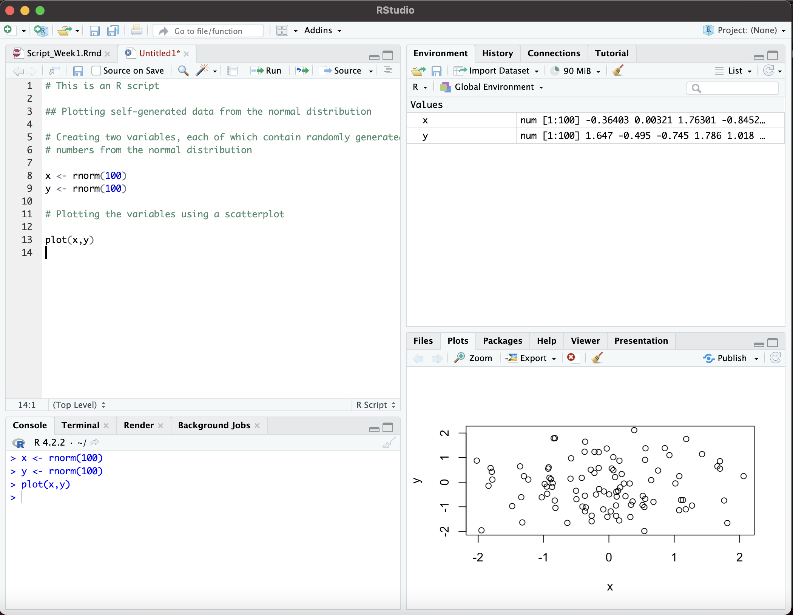
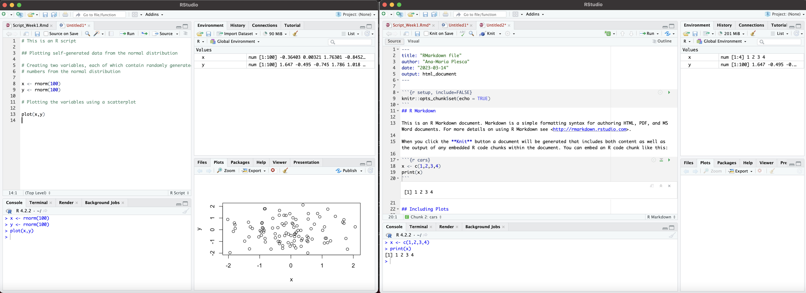
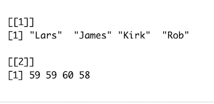
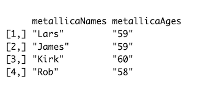
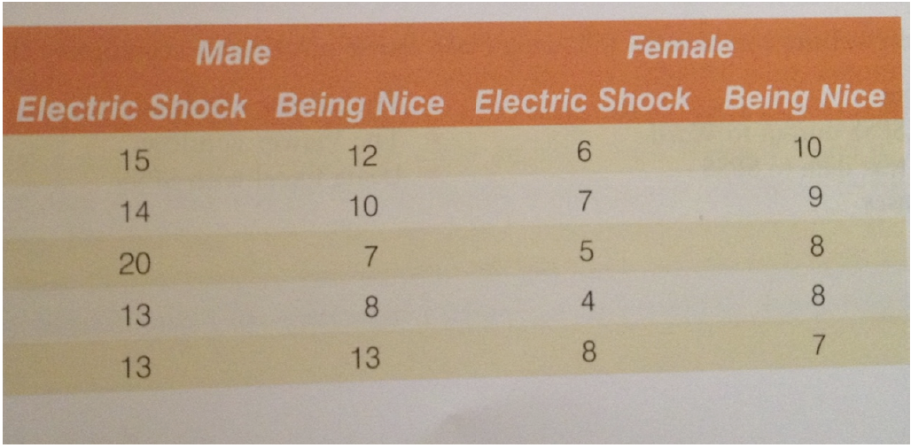
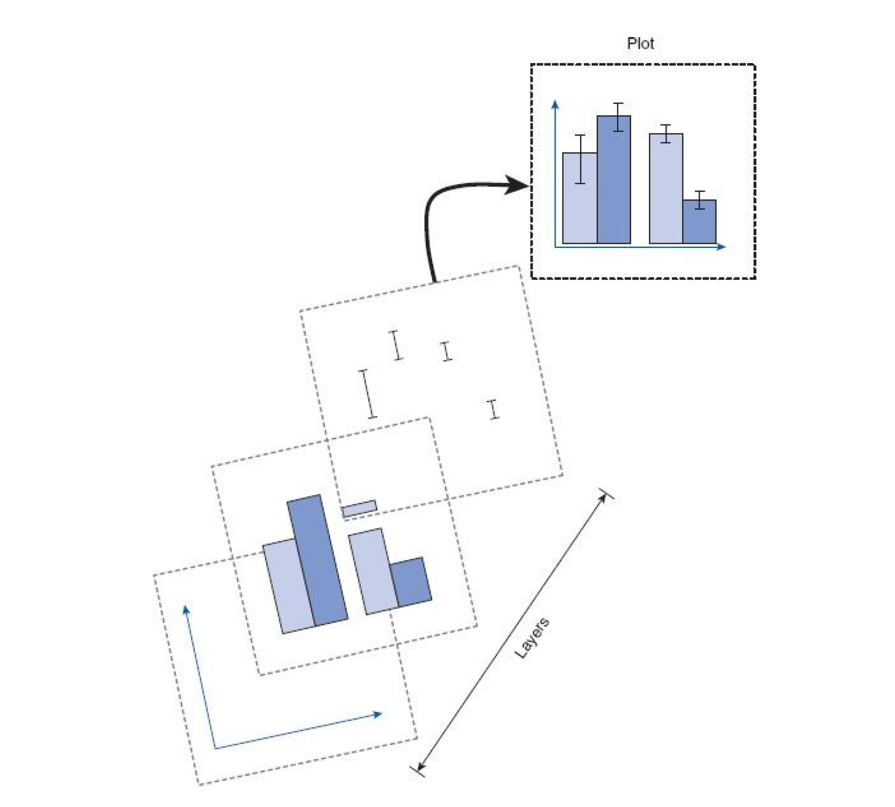

```{r setup, include = FALSE}
#suppress the warnings and other messages from showing in the knitted file.
knitr::opts_chunk$set(
  fig.width  = 8, 
  fig.height = 5, 
  echo       = TRUE, 
  warning    = FALSE, 
  message    = FALSE,
  cache      = TRUE
)
options(repos = list(CRAN="http://cran.rstudio.com/"))
```

# Learning objectives

1. Understand the [R console](#rconsole) and the components of the [RStudio IDE](#rstudio_ide)
2. Understanding the basics of an [R script](#rscript).
3. [Create vectors](#vectors) and store values as [variables](#vars)
4. Understand the [basic data types](#data_types) (integer, double, character, logical)
5. Call [functions](#functions) and supply arguments
6. Discover the [basic data structures](#data_structures)
7. [Load data](#load_data) from a CSV and Excel files
9. Explore data using graphs

# Introduction

## What is `R`?

R is *a programming environment used for data processing and statistical analysis.*


Why should you learn R?

- It's open source and license free. 
- Ever-growing, numerous support community. (e.g., https://stats.stackexchange.com)
- "These days, it’s safe to say that R is the de facto standard in the language sciences" (Winter, 2019, p. xiii)
- It teaches you a bit of programming -> lots of open doors for future endeavors + fancier list of skills in your CV
- You get a deeper understanding of the data analysis steps and of the statistical tests/models
- Allows you to create *reproducible workflows* 


## Interacting with `R`

### The Base R Console
<a name="rconsole"></a>

&ldquo;Base R&rdquo; consists of a &ldquo;Read Evaluate Print Loop&rdquo; (REPL) command interpreter.
This means that you type commands intro the terminal, these are evaluated by R, and then you get results printed on the screen.
This is what the &ldquo;R Console&rdquo; window looks like. The screenshot below shows the R's response to a `print()` command.


### The RStudio Integrated Development Environment (IDE)
<a name="rstudio_ide"></a>


To make our lives and interactions with R easier, we will be using an environment that will allow us to develop scripts. This means that we will be using a text editor (upper left pannel) and send commands to the R console (lower left pannel). For the purpose of this course we will be using RStudio.



In addition to the console (appearing as the bottom left window in the above figure), there is a text/script editor (top left), which provides syntax highlighting, auto-completion, and pop-up tool tips, a window showing functions and objects residing in memory for the session in the &ldquo;Environment&rdquo; tab (top right window in the figure), and a window that shows plots, files in the working directory, available add-on packages, and documentation (bottom right).

We will thus use RStudio to communicate with R. When wanting to use R to develop scripts, make sure to launch RStudio and not R! 

<p class="alert alert-info">To make your interaction with RStudio easier, try to learn keyboard shortcuts. Go to _Help_ -> Cheat Sheets</p>

<p class="alert alert-info"> *Tip of the day: Keep your workspace clean!*
Go to the Tools menu -> Global Options -> General and uncheck the box that says &ldquo;Restore .RData into workspace at startup&rdquo;. 
If you keep saving your workspace, things will get messy, and unexpected things will happen. You must always start with a clear workspace.  This means that you never want to save your workspace when you exit.  The only thing to save is your script.</p>

### Wait a second. What is the .Rmd file we are working with?

You might have noticed that this file is not an R script. Instead, we are using an RMarkdown file, with an `.Rmd` extenstion. This allows us to keep both readable text and code chunks in the same place. Otherwise, text should have been commented out in a simple R script (in the left picture below, the text that accompanies code is commented out with a `#` and shown in green). Check out the screenshot below for a comparison. An R script is depicted on the left, and an RMarkdown file on the right.



### Navigating R

Here are some helpful shortcuts and indications
<a name="structure"></a>


- To run code/code chunks: Control + Enter (Windows) or Command + Enter (Mac).
Alternatively you can press on Run button (located in the right upper corner of the editor pane.)

```{r}
print("Hello!")
print("a!")
print("bb!")
```

- Switch to editor screen: Ctrl + 1 (Windows and Mac) 
- Switch to console:Ctrl + 2 (Windows and Mac) 
- Attempt completion Tab or Ctrl+Space(Windows) Tab or Ctrl+Space (Mac).

```{r}
print("blue")
```

- Insert code chunks:  Command + Option + I (Mac); Ctrl + Alt + I (Windows)

```{r}
1 + 4 + 2
```


Text eintippen


```{r}
1 + 2 
```

- Save your progress: Ctrl + S (Windows) or Command + S (Mac)

Alternatively you can press on the floppy disk icon in the upper left corner above the editor pane
- Check once in a while how the script looks like by pressing on "Knit" (the yarn symbol). This will create an HTML file of your script and you will get a nice and more readable overview of the script's contents.

For more shortcuts, tips and tricks go to **Help**-> **Keyboard Shortcuts Help**


# The basic elements of an R script

All scripts should follow this generic structure:
<a name="structure"></a>

-   set up your working directory
-   load in any add-on packages you need to use
-   define any custom functions you might need
-   load in the data you will be working with
-   work with the data
-   save anything you need to save (but not the workspace)

Small vocabulary:

- package = collections of functions, code, datasets that help you achieve a specific goal (plot data - `ggplot`, preprocess data - `tidyverse`)
- function = similar to a recipe. You need to add and combine arguments (ingredients), and based on some statements (instruction steps), it provides you with an end result.

Next up, we will replicate this workflow and follow Chapter 3 of Andy Field's coursebook: "Discovering Statistics using R"

### Set up a working directory

1. Create a folder (in the usual way in Windows or MacOS) and place the data files you’ll be using in that folder. 

2. When you start your session in R change the working directory to be the folder that you have just created. 

3. Let’s assume that you have a folder in ‘My Documents’ called ‘Data’ and within that you have created a folder called ‘R Book Examples’ in which you have placed some data files that you want to analyse. 

4. Set the working directory using `setwd():`

```{r}
# This is an EXAMPLE of setting up a working directory based on the previous steps.
# setwd("C:/Documents/Data/R Book Examples”) - for mac paths
# setwd("C:\Documents\Data\R Book Examples”) - for windows paths
```

- **Exercise:** Set up your own working directory. 
```{r}
setwd("/Users/anamariaplesca/Desktop/Stats planning/Script 1")
```

5. Once a working directory is set up, you can access files within it. For example:

```{r}
# The code below is just an example!
# myData = read.delim("data.dat")
```

### Install packages

Since this is probably the first time you are using R, you will need to install a few packages. You only need to do this once, or if you re-install R. If you wish to do this manually, go to the bottom right pane, choose the Packages menu and search for the package you wish to install. However, I recommend installing packages using the `install.packages()` function as exemplified below:

```{r install_packages1, results='hide'}
# This code will install packages
install.packages("foreign") # for reading and writing data
install.packages("Hmisc") # for data analysis tools
install.packages("reshape") # for reshaping and aggregating (i.e., combining) data 
install.packages("ggplot2") # for plotting
install.packages("plyr") # data pre-processing
install.packages("tidyverse") # tidy data pre-processing and structuring
install.packages("Rmisc")
```
If you are ever curious about what a package does, Google is your friend. For example, you can type: "R package Hmisc" and it will take you to website like: https://cran.r-project.org/web/packages/Hmisc/index.html

Alternatively type `?package_name` in the console (e.g., `?reshape` or `??reshape` and the Help menu in the bottom right page will offer additional information about the package or function that is relevant to you. `reshape` is just used as an example here.)

### Add-on functions

```{r}
#A function to make it quick to save graphs in the image directory. We will use this in the later steps of our script

saveInImageDirectory<-function(filename){
	imageFile <- file.path(imageDirectory, filename)
	ggsave(imageFile)	
}

### Please adjust this path to the images folder inside your working directory. 
imageDirectory <- "/Users/anamariaplesca/Desktop/Stats planning/Script 1/images"
```

### Call library contents

Once your packages are installed, you need to call them from your library of installed packages. You need to do this every time you wish to use packages in your scripts.

```{r loading_library}
library(foreign)
library(Hmisc)
library(reshape)
library(ggplot2)
library(plyr)
library(tidyverse)
library(Rmisc)
```

### Start working on your script

In the following steps, we will develop our script as we get to know the basic data types, how to create structures of data and manipulate them. Later on, we will take a closer look at complex structures of data and learn how to understand it via visualization.

# Variables

What is a variable? A container for storing data values. Use the assignment operator `<-` to assign the value on the right to the variable named on the left.

<p class="alert alert-info"> Use shortcuts to type in fast the assignment operator: Alt + - (Windows) or Option + - (Mac).</p>


```{r assignment}
# R will store the value 3 in the variable named my_first_variable
my_first_variable <- 3
```

There are some important things to consider when naming your variables.

-   must begin with a letter (`a2` is a valid name, but `2a` is not)
-   use the &rsquo;\_&rsquo; where you would use a space (e.g., `my_var` is a valid variable
    name). Do not use special characters `(^&"'*+?)` as delimiters.
-   use names that help you remember what is stored in your variable. If a variable
    contains information about the number of participants in an experiment, name your variable               `participants_no` instead of `my_var`.
-   capitalization can be useful (e.g., `myVariable` vs. `myvariable`)

A variable is called a variable also because you may change and update its value.

```{r}
# If you compute this multiplication, the value stored in `my_first_variable` will be multiplied by 3.
# This will not change the value of `my_first_variable`
my_first_variable * 3

# You can store the result of the multiplication in your variable and thus update its value
my_first_variable <- my_first_variable * 3
```


## Variable types

Variables can come in different flavors and that is because you can store different data types in them.

There are four main basic data types in R. There are more to come, but for now keep these in mind:

| data type         | examples                         |
|-------------|----------------------------------|
| `character` | "cat", "stats", "12:30", "1990s", |
| `integer`   | 12L, 5L, 1L, -20L                  |
| `double`    | 20, 3.1415, -129.7, 0.021, -3.5e6    |
| `logical`   | `TRUE`, `FALSE`                   |

Depending on which data type you store in your variable, your variable can also be of a certain type.

1. **String variables containing character values**
```{r}
# A string variable containing a character value
character_var <- ("stats")

# Using the `typeof()` function to find out the type of data stored in the variable
typeof(character_var)
```

2a. **Numeric variables containing values of integer type**
```{r}
# A numerical value storing an integer value. An integer is a whole number that is not a fraction. The L after the number ensures that the value is stored as an integer.

num_var_1 <- 20L
typeof(num_var_1)
```

2b. **Numeric variables containing values of double type**
```{r}
# A numerical value storing a double value. A double data type is a double precision floating point value. In other words, it contains a whole and a fractional part after the decimal.

num_var_2 <- 20.2
typeof(num_var_2)
```

3. **Logical variables**
```{r}
# A logical or boolean variable including a logical data value. There are only two possible values: `TRUE` or `FALSE`

logical_var <- TRUE
typeof(logical_var)
```
# Basic data structures

## Vectors
A vector is one of the most fundamental data types in R and it represents a set of ordered elements.  All of the elements in a vector must be of the same *data type* (either only numeric, or only character, etc.).  You can create a vector by enclosing the elements in `c(...)`, as shown below.

We will exemplify how vectors work and what we can do with them based on the heavy metal band Metallica.

```{r metallica_vectors}
# Creating a character vector `metallica`, containing character values representing the band members
metallica<-c("lars", "james", "Jason", "Kirk")

# Let's take a look at the vector contents
metallica

# Something is not right! Jason is no longer a member of the band. Rob replaced him. Let's change this value in our vector in three steps:

## 1. Keep all elements from the metallica vector that are not equal to "Jason"
metallica <- metallica[metallica != "Jason"]

## 2. Take a look at what's changed
metallica

## 3. Add "Rob" to our `metallica` vector, since he is the band member that replaced "Jason"
metallica<-c(metallica, "Rob")
```

A vector is a set of ordered elements, and this is indicated also by the [1] next to the first value of the vector in the output. This means that "lars" is the first element of the `metallica` vector.

```{r metallica_vectors2}
metallica
```

This allows us to index values and also alter them.

```{r metallica_vectors3}
metallica[3] # Kirk
metallica[1] <- "lars - drummer"
```

- **Exercise:** Change the values of the `metallica` vector by adding which role had each of the four band members. In case you don't know: James is the lead vocals, Kirk is the lead guitar and Rob plays the bass. Use indexing to perform this task.

```{r metallica_vector4}
metallica
```

- **Exercise:** Create one new vector called `metallicaNames` and include all band members' names starting with a capital letter 

```{r metallica_exe1}

```

- **Exercise:** Create another vector called `metallicaAges` that contains the ages of the band members. To spare you some time, here's all the information you need: Lars, James are 59 years old, Kirk is 60 years old, and Rob is 58 years old. Do not enter the values randomly - keep in mind that vectors contain ordered elements and the age should match the order of the names in the previous vector `metallicaNames`

```{r metallica_exe2}

```
## Lists

Another fundamental data structure, which unlike vectors can contain different data types is represented by lists.

Let's create a list containing characters, numbers, logical values, and even vectors:

```{r lists1}
mixed_list <- list("one", 2, TRUE, c(3.2, 3.1))
mixed_list
```
The first element of the list is the character string "one". The second element of the list is the logical value `TRUE`, and the fourth element of the list is a concatenated vector contaning double numerical values.

You can access elements of a list in a similar way as you did for vectors, via indexing

```{r lists2}
mixed_list[1] # first element
```

If your list contains complex elements, such as vectors, you have two levels of indexation

```{r lists3}
# Access the fourth element of the list and within that, the first element
mixed_list[[4]][1]
```


- **Exercise:** Use the function `list()` to combine the `metallicaNames` and `metallicaAges`. Store the result in a variable named `metallica_list`. You will have created your first list. The result should look like this:



```{r}
# Create a list called `metallica_list`
```

- **Exercise:** Try indexing your `metallica_list`. What will show up if you index at [[1]][1], what about [[2]][3]? Play around a bit

```{r metallica_list1}
# Index the `metallica` list and use comments to document the results
```

- **Exercise:** Let's add the band members' surnames (for this you would need to google their surnames). Use indexing and the assignment operator `<-` to replace the existing values. (If you feel stuck, scroll back up to the section about variables.)

```{r metallica_list2}
# Add the band members' surnames in the metallica_list 
```
 
## Arrays/Matrices
In R matrices or arrays are atomic vectors with dimensions represented by the number of rows and columns. They are thus an extension of the numeric or character vectors and must be of the same data type.

```{r matrix1}
# Constructing a 2x2 matrix by hand (2 rows and 2 columns)

simple_matrix <-  matrix(c(1, 2, 3, 4),
                         nrow = 2,
                         ncol = 2)

simple_matrix
```


- **Exercise:** Use the function `cbind()` to combine the `metallicaNames` and `metallicaAges`. Store the result in a variable named `metallica_matrix` The end result should look like this:



```{r metallica_matrix1}

```

Congrats! You have thus created your first array (matrix), which is a data structure with two dimensions. However, when you combined `metallicaNames` and `metallicaAges` something happened.


- **Exercise:** Use the `class()` or the `typeof()` function to remind yourself what type of vectors `metallicaNames` and `metallicaAges` are. Also check the class or type of the metallica array.  
```{r metallica_matrix2}

```

**What happened there?** When you combined two vectors of different types `metallicaNames` - character and `metallicaAges` - numerical, the second vector was coerced to the type of the first vector. That is because an array/matrix can only contain one type of data. 


- **Exercise:** Try indexing your `metallica_matrix` array. What will show up if you index metallica at [1,1], what about [1,2]? Uncomment the line codes and then add comments of the results.

```{r metallica_matrix3}
# Index the array and document the results with comments
```

## Data frames 

You can also create new data structure - *a data frame*. A data frame can contain different data types and is structured in columns and rows.

```{r data_frames1}
Names<-c("Lars", "James", "Kirk", "Rob")
Ages<-c(59, 59, 60, 58)

# Creating the data frame
metallica_df <- data.frame(Names, Ages)

# The dataframe you have created has a 4 x 2 dimension. There are 4 rows and 2 columns.
metallica_df
```

Check the structure of `metallica_df` using the `str()` function, which also informs about the data types in your data frame

```{r data_frames2}
str(metallica_df)
```
You have a combination of character and numerical values! This shows that data frames allow you to include data of different types.

```{r data_frames3}
# You can also add additional columns to the dataframe using the `$` operator. 
metallica_df$childAge<-c(24, 24, 16, 18)

# And you can create a new column based on pre-existing columns using the `$` operator.
metallica_df$fatherhoodAge<-metallica_df$Age-metallica_df$childAge
```

- **Exercise:**  Add a column to the `metallica_df` called `newChildAge`. Create this column by multiplying the current values in `childAge` by 2. (Hint: You can do this in one step.)

```{r data_frames4}

```

### Creating dataframes

It's useful to know how to create more complex dataframes by hand. Sometimes you will be asked to replicate tables from books/pictures, and in what follows we will do exactly that. Take a look at the photo below and follow the demonstration of how it's done. You will need this sooner than you think.



Keep in mind that we will not be able to create a table that looks exactly the same, but we will concentrate on the structure of the data. These data show the score (out of 20) for 20 different students some of whom are male and some female, and some of whom were taught using positive reinforcement (being nice) and others who were taught using punishment (electric shock). 

We'll use the rep() function. The rep function has 2 parameters/arguments, the value to repeat and the number of times to repeat it.

```{r df}
# In total, there are 10 instances of each condition. Since we have a total of 20 data points, 10 will represent electric shock, and 10 positive reinforcement
method <- rep(c("Electric Shock", "Being Nice"), each = 10)

# For each method, we have 5 male and 5 female participants. We can nest the rep call to create the necessary pattern. That means, we create 5 instances of Male and 5 instances of Female values, and then we repeat this pattern 2 times
gender <- rep(rep(c("Male", "Female"), each = 5), 2)

# Score - manual work:
score <- c(15, 14, 20, 13, 13, # male scores + electric shock
           12, 10, 7, 8, 13,   # female scores + electric shock
           6, 7, 5, 4, 8 ,     # male scores + being nice
           10, 9, 8, 8, 7      # female scores + being nice
           )

# putting it all together
method_of_teaching <- data.frame(method, gender, score)

#check the result
method_of_teaching
```


# Exploring data with graphs

We have spent some time exploring different types of data and we have seen how we can group data in simple structures such as vectors, or complex ones, like dataframes. For the purpose of the next part of our script, we will focus on learning to visualise our data. This is an essential skill that allows us not only to check if our data make sense, and to identify any unusual trends, but also to present the features of our data.

In R we will build plots using the function `ggplot()` from the package `ggplot2`. `ggplot()` builds plots by combining layers and thus allows for maximal flexibility when it comes to customizing plots. This might seem laborious and complex at first, but in the long run this means you will be able to create complex and neat-looking plots. Check out the figure below  from Field et al. (2012) showing a graphic overview of how `ggplot()`works.



## Importing datasets in R

In order to get started, let's import a data file. We will be working with the *Chickflick* dataset that you are already familiar with. Remember that your data files need to be in the same folder (working directory) as your script. If that's not the case, R will throw an error!

```{r import}
chickflick_data <- read.delim(file = "ChickFlick.dat")
```

## Exploring data

Look at the structure of your data using the `str()` function. You will find out what type of data resides in each column

```{r chickflick1}
str(chickflick_data)
```
Before we proceed with our visualization quest, we need to think about how we would like to visualise our data. For instance, we can plot the average arousal scores as a function of gender and or the film that that the participants have seen.

This brings up an important issue: While it is true that the variables 'gender' and 'film' are characters, they in fact represent categories, or **factors**. Factors are variables used to categorize the data and have a limited number of values. In this example, `gender` is represented only by the male and female values.

We will recode the `gender` and `film` variables as factors using the function `mutate()`. This way we will override the original variables with the same data, but classified as factors. The function `as.factor()` will coerce the character data into factor data.

```{r chickflick_factor}
chickflick_data <- chickflick_data %>% 
  mutate(gender = as.factor(gender),
         film = as.factor(film))

# Check the structure again and the new data types
str(chickflick_data)
```
### Histograms

**Plotting average arousal scores as a function of the film**

For our first example we will create a histogram showing how often the arousal scores occur in our data as a function of the film that the participants have seen.

Regardless of the type of graph we want to create, we always start with the `ggplot()` function, which creates a canvas to print elements to. The function takes two arguments:
<a name="structure"></a>

- A data frame as the first argument. We will use `chickflick_data`
- The second argument maps columns in the dataframe to the plot aesthetics. The mapping takes place via the `aes()` function. Here we map the arousal score to the x-axis.

```{r hist1}
ggplot(data = chickflick_data, aes(x = arousal))
```

Don't be surprised that we are not seeing anything meaningful yet. We are yet to instruct `ggplot()` to draw a histogram for us. For this, we add a histogram geometry to the basic layer using `geom_histogram()`. We can add color and fill features to the histogram layer using the `color=` and `fill=` arguments. We can also adjust the size of the bins. Remember that bins are summarized categories of the data we're plotting.


```{r hist2}
ggplot(data = chickflick_data, aes(x = arousal))+
  geom_histogram(color = "blue", fill = "lightblue", bins = 10)

```
So far we are getting a picture of all arousal scores. We can visualize data in different groups in separate graphs using facets. This will split the visualization into several subplots for each category. This can be done using the `facet_grid()` function. 

Use the `labs()` layer to add customized names to the x and y axis, as well as to add a plot title
```{r hist3}
# Plotting arousal scores as a function of film
ggplot(data = chickflick_data, aes(x = arousal))+
  geom_histogram(color = "blue", fill = "lightblue", bins = 10) +
  facet_grid(~film)+
  labs(x = "Average physiological arousal", y = "Frequency")+
  labs(title = "Average physiological arousal as a function of film")
```

**Plotting average arousal scores as a function of gender**

- **Exercise:** It's your turn to plot! Your task is to plot the average physiological arousal scores as a function of gender. Hint: You only need to change the argument of the `facet_grid()` layer. Make sure to also change the color of the bins. Check the third page of this document: https://www.nceas.ucsb.edu/sites/default/files/2020-04/colorPaletteCheatsheet.pdf

```{r hist4}

```

**Plotting average arousal scores as a function of gender and film**

```{r hist5}
# Plotting arousal scores as a function of gender and film
ggplot(data = chickflick_data, aes(x = arousal, fill =  gender, color = gender))+
  geom_histogram( color = "blue", fill = "lightblue", bins = 10) +
  facet_grid(gender~film)+
  labs(x = "Average physiological arousal", y = "Frequency")+
  labs(title = "Average physiological arousal as a function of gender and film")
```

If you wish to overlay a density curve over your histogram(s) you need to pass `aes(y = ..density..)` to `geom_histogram` and add `geom_density` as shown below:

```{r hist6}
# Plotting arousal scores as a function of gender and film + density curves
ggplot(data = chickflick_data, aes(x = arousal))+
  geom_histogram(aes(y = ..density..), color = "blue", fill = "lightblue", bins = 10) +
  facet_grid(gender~film)+
  labs(x = "Average physiological arousal", y = "Frequency")+
  labs(title = "Average physiological arousal as a function of gender and film")+
  geom_density(lwd = 1.2,
                linetype = 1,
                colour = 2)        
```

```{r}
# Save your plot. Before running this code make sure to run the corresponsing plot code.
saveInImageDirectory("Chickflick_histogram_density.png")
```

What can we learn from this plot? What can you say about the arousal scores for each gender and film?


**Why add the density curve?**
<a name="structure"></a>

- It helps you understand the distribution of values in a dataset
- A density curve gives you an idea of the shape of a distribution. It shows whether the distribution has frequently occurring values (peaks).

### Barplots

Barplots show the relationship between a numeric and categorical variable. Each subgroup of a categorical variable is represented via bars along the x-axis (e.g., Memento and Bridget Jones' Diary as subgroups of the categorial variable film). On the y-axis, the size of each bar represents its numeric value and is computed based on a statistic, such as the mean. 

We will use a barplot to gain a better understanding of the average effects of each film on our outcome variable, physiological arousal:

**Plotting the average physiological arousal as a function of film**
```{r barplot1}
# Plotting 
ggplot(data = chickflick_data, aes(x = film, y = arousal, fill = film))+ # defining the axes of our plot. 
  # The fill argument ensures that different colours are used for the subgroups of our factor film.
  geom_bar(position = "dodge", #preserves the vertical position of an geom while adjusting the horizontal position
           stat = "summary",   # which statistic should be used? a summary statistic.
           fun = "mean",       # we are using the mean as the function that helps us build the barplots.
           color="black")+     # the outline of the bars will be black
# with `geom_bar()` we added the geometric layer that draws the barplot showing the mean of each category of our film factor levels.
  labs(x = "Film", y = "Average physiological arousal", fill = "Film",
       title = "Average physhiological arousal as a function of the film that was watched")+ # renaming the x and y axis, the colour legend, creating a title
  scale_fill_brewer(palette = "Blues") # This layer adds colors to the barplots using a color scheme
```

**Plotting the average physiological arousal as a function of gender**

-**Excercise**: It's your turn to build a barplot, but this time around, plot the the average physiological arousal as a function of gender. 

```{r barplot2}

```

**Plotting the average physiological arousal as a function of film and gender**

```{r barplot3}
ggplot(data = chickflick_data, aes(x = film, y = arousal, fill = gender))+ 
  # we represent the films as categories on the x-axis and the colours represent the different genders
  geom_bar(position = "dodge", 
           stat = "summary",   
           fun = "mean",       
           color="black")+     
  labs(x = "Film", y = "Average physiological arousal", fill = "Gender",
       title = "Average physhiological arousal as a function of the film that was watched")+ 
  scale_fill_brewer(palette = "Blues")

```

**Error bars**

You might also need to add error bars to your plots. More specifically, we will add error bars baded on **confidence intervals** - these indicate the *reliability of a measurement*. Since we use a 95% confidence interval (CI), the error bars indicate a range that would capture the population mean 95% of the time. 

Example: If you use a 95% CI and collect 20 samples and compute their means and CI ranges, then 19 of those ranges would contain the true population mean.

Another good thing to keep in mind: If the error bars do not overlap, this is an indicator that the samples are associated with belong to different populations. By contrast, if they overlap, then the samples might be stemming from the same population. The error bars provide you with information that gives you a hunch about the differences and variability in your data.


**Plotting the average physiological arousal as a function of film and gender with error bars**

We will add error bars by way of the `geom_errorbar()` layer. However, we need to compute some summary statistics first such as the standard deviation, standard error, mean and confidence intervals. We will do that using the `summarySE` function from the `Rmisc` package.

```{r barplot4}
# Summarizing the data based on our two grouping variables: gender and film
chickflick_data_summary <-summarySE(chickflick_data, measurevar = "arousal", groupvars = c("gender","film"))
```

```{r barplot5}
# We will build the barplot with 95% CIs based on the `chickflick_data_summary`
ggplot(chickflick_data_summary, aes(x=film, y=arousal, fill=gender)) + 
    geom_bar(position=position_dodge(), stat="identity", color = "black") +
    geom_errorbar(aes(ymin=arousal-ci, ymax=arousal+ci), # Minimum CI threshold = mean - ci (from chickflick_data_summary)
                                                         # Maximum CI threshold = mean + ci (from chickflick_data_summary)
                  width=.2,                              # Width of the error bars
                  position=position_dodge(.9))+
  labs(x = "Film", y = "Average physiological arousal", fill = "Gender", 
       title = "Average physhiological arousal as a function of gender and watched film")+ 
  scale_fill_brewer(palette = "Blues")

```

```{r}
# Save your graph with the function we defined. Remember to run the plot before saving it
saveInImageDirectory("Chickflick_Barplot_ArousalByGenderAndFilm.png")
```

- **Exercise** What can we learn from this plot? Please describe what we can learn about the data in one or two sentences.


### Boxplots

Boxplots are very useful to gain an understanding of the distribution of the continuous variable in your data (e.g. physiological arousal). They are also called box and whiskers plots!

Elements of a boxplot:
<a name="structure"></a> 

- **Box**: Extends from the first (Q1) to the third quartile (Q3), thus representing the interquantile range (IQR - extends from Q1 to Q3) . Additionally, it displays a line in the middle, which represents the median. 

- **Whiskers**: These are lines that extend from both ends of the box and indicate variability beyond Q1 and Q3.  The minimum/maximum whisker values are calculated as Q1/Q3 -/+ 1.5 * IQR.

Everything that appears outside the whiskers is an outlier (i.e., an extreme value).

Boxplots help you visualize data distributions as well as compare them, identify outliers, and are thus great for summary statistics.

Here's a great resource to gain a better understanding of boxplots: https://www.khanacademy.org/math/statistics-probability/summarizing-quantitative-data/box-whisker-plots/a/box-plot-review

**Plotting the distribution of arousal scores as a function of movie**

```{r boxplots1}
ggplot(data = chickflick_data, aes(x = film, y = arousal, fill = film))+
  geom_boxplot() +
  labs(x = "Film", y = "Average physiological arousal", 
       title = "Average physhiological arousal as a function of movie")+ 
  scale_fill_brewer(palette = "Reds")
```

**Plotting the distribution of arousal scores depending on gender**

-**Excercise**: It's your turn to build a boxplot. Plot the the average physiological arousal as a function of gender.

```{r boxplot2}

```

**Plotting the distribution of arousal scores depending on gender and film**

-**Excercise**: Plot the the average physiological arousal as a function of gender and film. If you feel stuck, re-visit the previous barplots that included both the gender and the film factors. (Hint: feed the right arguments within the aesthetics `aes()` of `ggplot()`)

```{r boxplot3}

```

**Adding error bars**

This time around, adding error bars is easier, since the geometric layer `stat_boxplot()` does that for us. All we need to do is add the argument `geom` with the value `"errorbar"`.

```{r boxplot4}
ggplot(data = chickflick_data, aes(x = film, y = arousal, fill = gender))+
  geom_boxplot() +
  stat_boxplot(geom = "errorbar")+
  labs(x = "Film", y = "Average physiological arousal", fill = "Gender",
       title = "Average physhiological arousal as a function of gender and watched film")+ 
  scale_fill_brewer(palette = "Pastel1")
```

```{r}
# Save your plot
saveInImageDirectory("Chickflick_Boxplot_ArousalByFilmAndGender.png")
```

- **Exercise** What can we say about the distribution of the data based on this plot? Please describe what we can learn about the data in one or two sentences.

# Finish line

Before you close your script, please remember to save your progress. You can either press on the floppy disk icon, or press on `Ctrl/Command + S`.

Also press on `Knit` to create an HTML version of your script. If all has gone well, the HTML version will pop-up as a secondary RStudio window once the processing is finished. You may, however, encounter errors. They are usually informative and lead you to the line where the error has occurred.

Congratulations on working with your first script in R! As complex as it may seem, you got this! Never forget that practice makes perfect, and that R is not the easiest thing to learn, so if you ever get stuck, chin up!

Please upload this script to Moodle. Make sure you upload an error-free script that can be Knitted.
