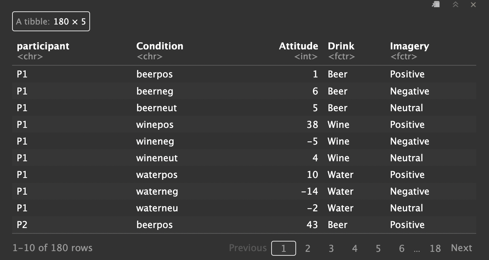

```{r setup, include=FALSE}
knitr::opts_chunk$set(echo = TRUE)
```


```{r, message=FALSE, warning= FALSE}
library(tidyverse)
library(psych)
options(scipen = 999)
```


# Introduction

Welcome to the 13th and the last R script - you have certainly come a long way! In this script you will use your already existing knowledge about one-way repeated-measures ANOVA (1 categorical variable) and take it to the next level, learning how to conduct two-way repeated-measures ANOVA analyses. This will enable you to explore data coming from more complex factorial designs. Much like was the case for the 1-wqy repeated-measures ANOVA, you will learn how to conduct the analysis using an ANOVA test, as well as using multilevel linear models. This script is based on Chapter 13 in Andy Field's introduction to R (2013), which I highly recommend you to read.

# Learning objectives
  
1. Understanding factorial designs: from design specification to main effects and interactions.
2. Applying already existing R knowledge about repeated-measures ANOVA on more complex data.

# A word on factorial designs

<p class="alert alert-info"> 
**Factorial designs** are experimental designs, that are used to assess and understand the effects of categorical variables (factors with levels) on dependent variables. In factorial designs, the predictor variables are all categorical (they're all factors).
Within factorial designs, experimental manipulations are introduced via the levels of the categorical variables (e.g., dosage of a drug: with a placebo level, a low dosage level and a high dosage level) - when analysing data coming from factorial designs, researchers aim to identify how each factor impacts the outcome variable, and how it may interact with other factors present in the design.
</p>

## Types of factorial designs

Typically, when an experiment/a study is built on a factorial design, there are 2 or more factors of interest based on which the modelling of the outcome variable(s) is done.

Let's go through some examples:

* **2x2** factorial design: refers to an experimental design with **two factors and two levels each**. The first integer refers to the number of levels of the first factor and the second integer refers to the number of levels of the second factor

Example: an experiment investigating the effect of education and income on life satisfaction (measured in scores from 0 to 100) considering the factors:

  + the factor *income* with 2 levels: *low* and *high* and
  + the factor *education* with 2 levels: *non-academic* and *academic*
  
* **3x3** factorial design: refers to an experimental design with **three factors and three levels each**. The first integer refers to the number of levels of the first factor and the second integer refers to the number of levels of the second factor.

Example: an experiment investigating the enjoyment of an ice cream sortiment (score from 0 to 100) as a function of the following factors:

  + e.g., the factor *texture* with 3 levels: *milky* and *sorbet*, *chunky*
  + the factor *flavor* with 3 levels: *chocolate* and *mango* and *cherry*
  + the factor *price-range* with 3 levels: *expensive*, *affordable*, *cheap*
  

* **Mixed factorial designs** - these designs typically include at least one **within-participants factor** (all participants see all the conditions/levels of this factor) and a **between-subjects factor** (some participants see one level of this factor, while others the remaining level(s))


There are many other ways in which factorial designs can look like, but the abovementioned ones are the most typical. Surely, there are many studies that involve for instance 3 factors, and they if the first factor would have 3 levels, while the two other factors two levels each, it would be specified as such: 3 x 2 x 2 factorial design.

However, for the time being, we will only look at designs with 2 factors, which brings us to another topic that deserves to be mentioned.

## Main effects vs. interactions

<p class="alert alert-info"> 
**Main effect** - represents the average effect of a factor, regardless of/ignoring the other factors.
</p>

Example: Let's say you are interested in finding out how education and age impact a person's income. If based on the analysis of the data you find a significant main effect of education, then the effect you have found has been observed regardless of the age factor. In other words, hypothetically, education is a factor that impacts income on both levels and regardless of the age factor.

Up until now you have only looked at the impact of one factor on the outcome variable and so far you have already identified main effects. You will now learn to identify main effects when there is more than one factor in the experimental design. Moreover, you will see that factors can also **interact** with each other.

<p class="alert alert-info"> 
**Interactions** represent situations in which the effect of one factor on the outcome variable depends on the value of another factor. To be more exact, we say that we have found an interaction between our factors, when the effect of one factor differs across the levels of another factor</p>.


## Patterns of factorial designs

For the sake of clarity, let's look at data patterns from a made-up experiment with a 2 x 2 factorial design. Let's say we have run a study and we looked at the effects of two types of therapy that should help patients with sleep disorders.

We randomly assigned half of the participants to receive sleep therapy and the other half to receive control therapy (so no therapy really). Participants will then be split randomly into a drug therapy group where they receive a sleeping pill, and a control group, whose members receive a sugar placebo pill. After participants receive the treatments, we measured their restfulness levels. 

### Scenario 1

```{r}
sleepStudy1<- tibble(
  sleepDrug = c("Placebo", "Drug", "Placebo", "Drug"),
  sleepTherapy = c("ST", "No ST", "No ST", "ST"),
  restfulness = c(60, 60, 40, 80)
)
sleepStudy1
```

Take a look at the mean restfulness values for each level of a factor. If you were to take the mean restfulness after treatment with the placebo sleeping pill regardless of sleep therapy, the value would be 50. The mean restfulness for the sleeping drug regardless of sleep therapy would be 70.  

```{r}
ggplot(data = sleepStudy1, aes(x = sleepDrug, y = restfulness, group = sleepTherapy, color= sleepTherapy)) + 
  geom_point()+
  geom_line()
```

- **Task 1** What do you think? Did the sleep therapy and the sleep drug have an effect on restfulness? Did the effect of sleep therapy depend on whether the patient has received sleep medication? Look at the data stored in the `sleepstudy` variable, where you will see the means for each group, and also consider the plot. 

Write your interpretation below.

----

### Scenario 2

```{r}
sleepStudy2 <- tibble(
  sleepDrug = c("Placebo", "Drug", "Placebo", "Drug"),
  sleepTherapy = c("ST", "No ST", "No ST", "ST"),
  restfulness = c(60, 40, 40, 60)
)
sleepStudy2
```

```{r}
ggplot(data = sleepStudy2, aes(x = sleepDrug, y = restfulness, group = sleepTherapy, color= sleepTherapy)) + 
  geom_point()+
  geom_line()
```

Take a look at the mean restfulness values for each level of a factor. If you were to take the mean restfulness after treatment with the placebo sleeping pill regardless of sleep therapy, the value would be 50. The mean restfulness for the sleeping drug regardless of sleep therapy would also be 50.  


- **Task 2** What do you think? Did the sleep therapy and the sleep drug have an effect on restfulness? Did the effect of sleep therapy depend on whether the patient has received sleep medication? Look at the data stored in the `sleepstudy` variable, where you will see the means for each group, and also consider the plot. 

Write your interpretation below.

----

### Scenario 3

```{r}
sleepStudy3 <- tibble(
  sleepDrug = c("Placebo", "Drug", "Placebo", "Drug"),
  sleepTherapy = c("ST", "No ST", "No ST", "ST"),
  restfulness = c(60, 50, 40, 90)
)
sleepStudy3
```

```{r}
ggplot(data = sleepStudy3, aes(x = sleepDrug, y = restfulness, group = sleepTherapy, color= sleepTherapy)) + 
  geom_point()+
  geom_line()
```

Take a look at the mean restfulness values for each level of a factor. If you were to take the mean restfulness after treatment with the placebo sleeping pill regardless of sleep therapy, the value would be 50. The mean restfulness for the sleeping drug regardless of sleep therapy would be 70. 

- **Task 3** What do you think? Did the sleep therapy and the sleep drug have an effect on restfulness? Did the effect of sleep therapy depend on whether the patient has received sleep medication? Look at the data stored in the `sleepstudy` variable, where you will see the means for each group, and also consider the plot. 

Write your interpretation below.

If you are having a tough time with tasks 1, 2 and 3 and need help check out the solution here, but before you do, please give it a shot on your own: https://box.hu-berlin.de/f/83cbbfaaa22143d29172/

This was only a  brief refresher about notions of main effects and interactions, and if you need an in-depth approach, here's a wonderful resource: https://psyteachr.github.io/stat-models-v1/interactions.html


# Factorial repeated-measures analysis 

## The dataset

We will now get back to our script's main topic: factorial repeated-measures ANOVA. Here are the main facts about the dataset that we will be working with (based on Fields, 2013 p. 583 ff.)


There is evidence from advertising research that attitudes towards stimuli can be changed using positive imagery (e.g., Stuart, Shimp, & Engle, 1987). The scientists designed a study to address this issue of excessive drinking by comparing the effects of negative imagery against positive and neutral imagery for different types of drinks.

The participants who have taken part in the study viewed a total of 9 mock adverts over 3 sessions. In one session they saw 3 adverts:

1) a brand of beer + a negative image
2) a brand of wine + a positive image
3) a brand of water + a neutral image

In the next session they saw the same three brands, but this time associated with different imagery:

1) a brand of beer + a positive image
2) a brand of wine + a neutral image
3) a brand of water + a negative image

In a third session, the participants saw another set of brands-imagery association:

1) a brand of beer + a neutral image
2) a brand of wine + a negative image
3) a brand of water + a positive image

After participants have seen each advert, they were asked to **rate the drinks on a scale from -100 (dislike very much) through 0 (neutral) to 100 (like very much)**.

The order of the adverts was randomized, as was the order in which the subjets participated in the three sessions. 

**The independent variables**:

* Type of **drink** (with 3 levels):
  + beer
  + wine
  + water

* Type of **imagery** used (with 3 levels):
  + positive
  + negative
  + neutral

**The dependent variable**: Ratings -100 to 0 to 100.

This is a **fully-crossed** factorial design (3 x 3), thus producing a total of **9 experimental conditions**.

- **Task 4**: Load the dataset `Attitude.dat` into R and save it into a variable called `attitudeData`. 

```{r}
attitudeData<-read.delim("Attitude.dat", header = TRUE)
```


```{r}
str(attitudeData)
```

- **Task 5**: Specify the format of the data

The data is in wide format

```{r}
attitudeData
```


- **Task 6**: Transform the data into long format to get a nicer overview of the data and get it ready for the next analysis steps. The result of the transformation should yeld a new Condition column, where the names of conditions are stored, and a new Attitude column, where the attitude values corresponding to each condition are stored. Keep the participants column in the dataset.


```{r}
longAttitude <- pivot_longer(attitudeData,
                             cols =c(1:9),
                             names_to = "Condition",
                             values_to = "Attitude")
```

- **Task 7**: Add a `Drink` and a `Imagery` column while taking into account the condition displayed in the `Condition` column

Hint 1: The condition in the first row is **beerpos** - As such, the new `Drink` column should contain the value *Beer* on the first row and the new `Imagery` column should contain *Positive* on the first row.

The condition in the second row is **beerneg** - As such, the new `Drink` column should contain the value *Beer* on the second row and the new `Imagery` column should contain *Negative* on the second row.

Hint 2: Use the `gl()` function to create the new columns.
 
```{r}
longAttitude <- longAttitude %>% 
         mutate(Drink = gl(3, 3, 180, labels = c("Beer", "Wine", "Water")),
               Imagery = gl(3, 1, 180, labels = c("Positive", "Negative", "Neutral")) )
```

## Descriptive statistics

Before we begin with the analysis, we need to take a look at the descriptive statistics

## Data summaries
 
You are already familiar with a few ways of generating descriptive statistics, but let's learn a new way to generate descriptive statistics. This time around you will get the code that generates the output, and you will be asked to explain what the code does. 

```{r}
if (!requireNamespace("pastecs")) {
  stop(install.packages("pastecs"))
} else {
  library("pastecs")
}

by(longAttitude$Attitude, list(longAttitude$Drink, longAttitude$Imagery), stat.desc, basic = F)
```

- **Task 8**: Describe how the code below works and what the arguments represent. Use the help page for this.

(This is a great way to train yourself to deal with R code that is new and not necessarily written based on tidyverse rules. What you are seeing is base R, which is closer to coding than tidy methods. Being able to understand new code is another skill that is necessary for mastering R)

The by() function is a wrapper for the tapply() function and it helps you apply a function to a data frame split by factors. This means that the first argument is coerced to a data frame, and to each row of this dataframe, a function is applied. The function to be applied is the third argument, here stat.desc, which is descriptive statistics and it is applied as a function of the list of factors defined within the second argument. Finally the basic argument shortens the output. Had it been set to True, you would have for instance gotten information about the instances of each category, presence of missing data, or null data.


- **Task 9**: Take some time to look at the descriptive values for each combination of `Drink` and `Imagery.` Write down any patterns that stand out to you.

Overall, it seems like the drink beer has gotten the highest attitude rankings compared to wine and water across all groups.


## Data visualisation

In order to gain an even better understanding of the data, in the next steps you will use barplots to explore the mean attitude values for the level of each factor separately. This will be a visual representation of the main effects of `Drink` and `Imagery`, which will help you build expectations for the upcoming analysis steps.


- **Task 10**: Draw a barplot of the average attitudes as a function of drink type. Please include error bars representing 95% CIs and describe the resulting plot.

```{r}
longAttitude_summary_drink <- Rmisc::summarySEwithin(data = longAttitude, measurevar = "Attitude", withinvars = "Drink", idvar = "participant")
longAttitude_summary_drink
```

```{r}
main_eff_drink <-  ggplot(longAttitude_summary_drink, aes(Drink, Attitude, fill = Drink))+ 
  geom_bar(position=position_dodge(), stat="identity")+
  geom_errorbar(aes(ymin=Attitude-ci, ymax=Attitude+ci), 
                  width=.2,                             
                  position=position_dodge(.9))+
  labs(x = "Type of Drink", y = "Mean Attitude", title = "Average attitude scores as a function of drink type") 

main_eff_drink
```

The barplot above representing the type of drink on the x-axis and the mean participant attitudes towards the drinks on the y-axis shows that overall, the drink beer was the most agreeable from all three, regardless of the imagery in the context of which it was presented. Furthermore, it shows that while wine was overall less appreciated than beer, it was more appreciated than water. The error bars are wide and are an indication of the fact that the true population means likely differ from the measured means. The error bars corresponding to the beer and water groups overlap the least, which is a sign that it is likely that the groups differ from each other.

- **Task 11**: Draw a barplot of the average attitudes as a function of imagery type. Please include error bars representing 95% CIs and describe the resulting plot.

```{r}
longAttitude_summary_imagery <- Rmisc::summarySEwithin(data = longAttitude, measurevar = "Attitude", withinvars = "Imagery", idvar = "participant")
longAttitude_summary_imagery
```

```{r}
main_eff_imagery <-  ggplot(longAttitude_summary_imagery, aes(Imagery, Attitude, fill = Imagery))+ 
  geom_bar(position=position_dodge(), stat="identity")+
  geom_errorbar(aes(ymin=Attitude-ci, ymax=Attitude+ci), 
                  width=.2,                             
                  position=position_dodge(.9))+
  labs(x = "Imagery type", y = "Mean Attitude", title = "Average attitude scores as a function of imagery type") 
main_eff_imagery
```

The barplot above displays the imagery factor levels on the x-axis and the average participant attitudes on the y-axis. Expectedly, the positive imagery has triggered the highest attitude scores, while the neutral imagery has triggered scores between values of 0-10, which is also in line with expectations. In a similar manner, neggative imagery has triggered scores that are directed towards negative values, this is further confirmed by the orientation of the error bar corresponding to the negative imagery bar. The error bars show no overlap between categories, which is an indication of the fact that the three imagery groups highly likely differ from each other.

## Contrasts

Prior to conducting the analysis, it is important to set the contrasts - remember that they help break down the main effects and interactions into more easily interpretable effects.

We will be setting contrasts for both **Drink** and **Imagery**.

Let's check the order of the levels of each factor - this is essential for defining contrasts

```{r}
levels(longAttitude$Drink)
```


```{r}
levels(longAttitude$Imagery)
```


### Drink contrasts

1) *Are there different effects for alcoholic vs. non-alcoholic drinks?*

- **Task 12**: Define the first contrast for the drink factor according to the specification above

```{r}
AlcoholvsWater<-c(1, 1, -2)
```

2) *Are the effects different for different types of alcoholic drink?*

- **Task 13**: Define the second contrast for the drink factor according to the specification above

```{r}
BeervsWine<-c(-1, 1, 0)
```

- **Task 14**: Set the contrasts you have defined for the drink factor

```{r}
contrasts(longAttitude$Drink)<-cbind(AlcoholvsWater, BeervsWine)
contrasts(longAttitude$Drink)
```

### Imagery contrasts

1) *Is negative imagery effective in triggering more negative attitudes compared to neutral and positive imagery?*

- **Task 15**: Define the first contrast for the imagery factor considering the question above

```{r}
NegativevsOther<-c(1, -2, 1)
```

2) *What is the difference between positive and neutral imagery?*

- **Task 16**: Define the second contrast for the imagery factor considering the question above

```{r}
PositivevsNeutral<-c(-1, 0, 1)
```

- **Task 17**: Set the contrasts you have defined for the imagery factor

```{r}
contrasts(longAttitude$Imagery)<-cbind(NegativevsOther, PositivevsNeutral)
contrasts(longAttitude$Imagery)
```
## Analysis option 1: Factorial repeated-measures ANOVA with `ezANOVA()`

- **Task 18**: Use the ezANOVA() function to run the analysis. Considering that there are two factors in the dataset now, please use the list notation when you specify the values of the function arguments.

- Please report which significant main effects and interactions that were found depending on whether the sphericity assumption was met or not

```{r}
attitudeModel<-ez::ezANOVA(data = longAttitude, dv = .(Attitude), wid = .(participant),  within = .(Drink, Imagery), type = 3, detailed = TRUE, return_aov = TRUE)

attitudeModel
```

Mauchly's sphericity test was computed for each of the three effects in the model (two main effects and one interaction). The significance values of these tests indicate that both the main effects of `Drink` (*p* < .001) and `Imagery` (*p* = .025) have violated this assumption and so the F-values should be corrected. For the interaction the assumption of sphericity is met (*p* = .436) and so we need not correct rhe F-ratio for this effect.

The output also shows the results of the ANOVA. Looking at the significance values, it is clear that there is a significant effect of the type of drink (sphericity
was violated, so for this effect we look at p[GG) or p[HF), both of which are significant because they are less than .05), a significant main effect of the type of imagery used (again sphericity was violated, so we look at p[CC) or p[HFj, both of which are significant), and  significant interaction between these two variables (sphericity was not violated).

### The effect of `Drink`

For the effect of drink it is advised to look and report corrected significance values, considering that the assumption of sphericity was violated. Since it is more conservative, we could report the Greenhouse-Geisser values: *GGe* = 0.58, *p[GG]* <.05 

Remember that unfortunately we cannot use the planned contrasts with `ezANOVA()`. However, let's take a look once again at the descriptive statistics and then run Bonferroni-corrected pairwise comparisons.

```{r}
longAttitude_summary_drink <- Rmisc::summarySEwithin(data = longAttitude, measurevar = "Attitude", withinvars = "Drink", idvar = "participant")
longAttitude_summary_drink

ggplot(longAttitude_summary_drink, aes(Drink, Attitude, fill = Drink))+ 
  geom_bar(position=position_dodge(), stat="identity")+
  geom_errorbar(aes(ymin=Attitude-ci, ymax=Attitude+ci), 
                  width=.2,                             
                  position=position_dodge(.9))+
  labs(x = "Type of Drink", y = "Mean Attitude", title = "Average attitude scores as a function of drink type") 
```

```{r}
by(longAttitude$Attitude, longAttitude$Drink, stat.desc, basic = FALSE)
```

- **Task 19**: Run pairwise comparisons for the `Drink` effect and report the results

```{r}
pairwise.t.test(longAttitude$Attitude, longAttitude$Drink, paired = TRUE, p.adjust.method = "bonferroni")
```

Based on the outcome of the pairwise comparisons, there was a significant difference between beer (*M* = 11.83 , *SD* = 15.28) and water (*M* = 3.52 , *SD* = 12.91) *p* < .01, and between wine (*M* = 8.33, *SD* =  16.78) and water (*M* = 3.52, *SD* = 12.91) *p* < .01, but not between beer (*M* = 11.83 , *SD* = 15.28) and wine (*M* = 8.33 , *SD* =  16.78) *p* = .35.

It is interesting to note that the beer condition was not significantly different from the wine condition, but take a moment to look at the standard error for beer, which is much later than that in the wine condition


### The effect of `Imagery`

As informed by the ANOVA output, there was a significant main effect of imagery, but considering that the assumption of sphericity was violated for `Imagery`, we will still report the values obtained after the more conservative correction, Greenhouse-Geisser *GGe* = .0.74, *p[GG]* <.001.

As was the case for the main effect of drink, we will take a glance at the descriptive statistics and then run pairwise comparisons to uncover which types of imagery different significantly from each other.

```{r}
longAttitude_summary_imagery <- Rmisc::summarySEwithin(data = longAttitude, measurevar = "Attitude", withinvars = "Imagery", idvar = "participant")

ggplot(longAttitude_summary_imagery, aes(Imagery, Attitude, fill = Imagery))+ 
  geom_bar(position=position_dodge(), stat="identity")+
  geom_errorbar(aes(ymin=Attitude-ci, ymax=Attitude+ci), 
                  width=.2,                             
                  position=position_dodge(.9))+
  labs(x = "Imagery type", y = "Mean Attitude", title = "Average attitude scores as a function of imagery type") 
```

```{r}
by(longAttitude$Attitude, longAttitude$Imagery, stat.desc, basic = FALSE)
```

```{r}
pairwise.t.test(longAttitude$Attitude, longAttitude$Imagery, paired = TRUE, p.adjust.method = "bonferroni")
```

The Bonferroni-corrected pairwise comparisons have shown significant differences between positive (*M* = 21.27 , *SD* = 9.79) and neutral imagery (*M* = 8, *SD* = 9.58) (*p* < .001), between positive and negative (*M* = -5.58, *SD* = 13.28) imagery (*p* < .001), as well as between neutral and negative imagery(*p* < .001), thus indicating that all three imagery types were different from each other significantly.

### The `Drink-by-Imagery` interaction

The ANOVA output indicated that there was a significant interaction between the drink and imagery factors, *F*(4, 76) = 17.15, *p* < .001 and since the interaction did not violate the sphericity assumption, no corrections were necessary.

- **Task 20**: In order to better understand the interaction, you next task will be to go back to the Attitude data in long format and plot the interaction via a line plot, as well as to generate descriptive statistics

Hint: In the case of this lineplot, the group argument within the ggplot aesthetics no longer needs to be specified with a "1" value. Instead, specify the relevant grouping variable.

```{r}
longAttitude_summary_interac <- Rmisc::summarySEwithin(data = longAttitude, measurevar = "Attitude", withinvars = c("Drink","Imagery" ), idvar = "participant")
longAttitude_summary_interac
```
```{r}
ggplot(longAttitude_summary_interac, aes(x = Drink, y = Attitude, color = Imagery, group = Imagery))+
  geom_point()+
  geom_line()+
  geom_errorbar(aes(ymin = Attitude - ci, ymax = Attitude + ci), width = .2,
                position = position_dodge(0.05))
```

What can we learn from the interaction graph?


The effect of imagery on the mean attitude rankings varied with type of drink and that is shown by the color-coded lines.
There seems to be a similitude in how both positive and neutral imagery have impacted all types of drinks. However, it is necessary to note that positive imagery led to overall ligher attitude rantings over all three levels of drinks compared to the neutral imagery.
By contrast, the the negative imagery seems to have impacted the attitude towards the three types of drinks differently. While the ratings for wine and water dropped, the attitude ratings towards beer remained high (approx at the same level as that obtained via neutral imagery). This suggests that compared with positive and neutral imagery, negative imagery affected the ratings of different types of drinks differently, and specifically different for wine and water compared to beer. 

In order to be able to further interpret the interaction, we should look at the contrasts. As you might remember, we can unfortunately not use our contrasts with `ezANOVA()`, but we can perform further pairwise comparisons.

To get post hoc tests for the interaction term we need to use a variable that combines
imagery and drink into a single coding variable. Fortunately we already have such a variable in the data set; it's called `Condition` in my case. You might have named it differently but it should have been created when we converted our original
data set from wide format to long.

For orientation, this is what the data should ideally look like in order for you to be able to use the appropriate column for the pairwise comparisons.



```{r}
pairwise.t.test(longAttitude$Attitude, longAttitude$Condition, paired = TRUE, p.adjust.method = "bonferroni")
```

For beer there are significant differences between positive imagery and both negative
(p = .002) and neutral (p = .020), but not between negative and neutral (p = 1.00); for wine,
there are significant differences between positive imagery and both negative (p < .001) and
neutral (p < .001), and between negative and neutral (p < .001); and for water, there are
significant differences between positive imagery and both negative (p < .001) and neutral
(p < .001), and between negative and neutral (p < .001). These findings support our earlier
conclusion that beer is unusual in that negative imagery does appear to reduce attitudes
compared to neutral imagery.

While this seems quite challenging, interpreting interactions in truly no easy feat. It takes time getting used to it, and the more you will deal with it, the more comfortable you will feel doing it.


## Analysis option 2: Factorial repeated-measures designs and multilevel linear models - OPTIONAL

In the previous script we have used `lme()`, which looks at repeated-measures data in a linear
model. The advantaged to this method are once again: we do not need to worry about the sphericity assumption, and we can easily use the contrasts we have planned to conduct from the very beginning.

The new element is that we will extend what you have already learned and applied by including one more predictor in the model and an interaction between our two predictors. As previously proceeded, in order to look at individual effects and their (non)significance, we build up the model from a baseline that includes no predictor other than the intercept.

**Optional Task 1**: Build a baseline model using the lme() function. 
Please specify the random element of model as `random = ~1/participant/Drink/Imagery`. This instructs R that the variables drink and imagery are nested within the variable participant (in other words, scores for levels of these variables can be found within each participant and each participnt is a source of random variability for the drink and imagery effects).

Hint: remember to load the `nlme` package

```{r}
baseline_model<-nlme::lme(Attitude ~ 1, random = ~1|participant/Drink/Imagery, data = longAttitude, method = "ML")
```


**Optional Task 2**: Next, build up the model by including the `Drink` factor and test whether it is significant. Report the results

Hint: to compare two models use the `anova()` function

```{r}
drink_model<-nlme::lme(Attitude ~ Drink, random = ~1|participant/Drink/Imagery, data = longAttitude, method = "ML")
```

```{r}
anova(baseline_model, drink_model)
```

The main effect of drink was found to be significant L(7) = 9.12, p < .05


**Optional Task 3**: Next, build up the baseline model by including the `Imagery` factor (but keep Drink out of the model to test the main effect of the model for now) and test whether it is significant. Report the results.

```{r}
imagery_model<-nlme::lme(Attitude ~ Imagery, random = ~1|participant/Drink/Imagery, data = longAttitude, method = "ML")
```


```{r}
anova(baseline_model, imagery_model)
```

The main effect of imagery was found to be significant L(7) = 149.34, p < .001

**Optional Task 4**: Build up the model maximally by including an interaction between Drink and Imagery. Specify this via this notation: `Drink*Imagery`. Use the anova() function to compare it to all previous models.

```{r}
interaction_model<-nlme::lme(Attitude ~ Drink*Imagery, random = ~1|participant/Drink/Imagery, data = longAttitude, method = "ML")
```

```{r}
anova(baseline_model, drink_model, imagery_model, interaction_model)
```

The interaction model has the lowest p-value and is thus the best fit for the data (this is also clear due to the AIC value which is the lowest for the interaction model compared to all other AIC values)


**Exploring the planned contrasts**

In order to explore the output of the best-fit model, i.e., the interaction model, use the summary() function. You will see that the results are shown in accordance to the contrasts you have set before. Take a moment to understand the output and report the results

```{r}
summary(interaction_model)
```


First, we get the two contrasts for drink, which show a significant effect on attitudes when comparing akoholic drinks to water, b = 2.19, t(38) = 3.18, P = .003, but not: when comparing beer with wine b = -1.75, t(38) = -1.47, P = .150. next, we get the two contrasts for imagery, which show a significant effect on attitudes when comparing negative imagery to other types, b = 6.74, t(114) = 17.26, P < .001, and when comparing positive to neutral imagery, b = -6.63, t(114) = -9.81, P < .001. The next four effects are
the contrasts for the interaction term and we'll look at these in turn.

**Alcohol vs. water, negative vs. other imagery**

The first interaction term looks at the effect of alcoholic drinks (i.e., wine and beer combined)
relative to water when comparing negative imagery with other types of imagery (i.e., positive and neutral combined). This contrast is non-significant. This result tells us that the decreased liking found when negative imagery is used (compared to other forms) is the same for both alcoholic drinks and water. The effect of negative imagery (compared to other forms) in lowering attitudes is comparable in alcoholic and non-alcoholic drinks, b = 0.19, t(114) = 0.69, p = .492.

**Beer vs. wine,. negative vs. other imagery**

The second interaction term looks at whether the effect of negative imagery compared
to other types of imagery (i.e., positive and neutral combined) is comparable in beer and
wine. This contrast is significant. This result tells us that the decreased liking found when
negative imagery is used (compared to other forms) is different in beer and wine.The effect of negative imagery (compared
to other forms) in lowering attitudes to beer was significantly smaller than for wine, b = 3.24, t(114) = 6.77, P < .001.

**Alcohol vs. water, positive vs. neutral imagery**

The third interaction term looks at whether the effect of positive imagery (compared
to neutral) is comparable in alcoholic drinks (i.e., wine and beer combined) relative to
water. This contrast is non-significant. This result tells us that the increased liking found
when positive imagery is used (compared to neutral) is similar for both alcoholic drinks
and water. Positive imagery has a similar effect in increasing attitudes (compared to neutral imagery) in both
alcoholic and non-alcoholic drinks, b = 0.45, t(114) = 0.93, P = .353.

**Beer vs. wine, positive vs. neutral imagery**

The final interaction term looks at whether the effect of positive imagery compared to
neutral is comparable in beer and wine. This contrast is not significant. This result tells us
that the increased liking found when positive imagery is used (compared to neutral) is comparable
in beer and wine. In summary, the effect of positive imagery (compared to neutral) in increasing attitudes to beer was not significantly different to that for wine, b = -0.66, t(114) = -0.80, P = .426.


--- 

This was surely a lot to take in and surely, the contrasts above do not go into details about all the differences between the levels of our two factors. For more thorough explorations, *post-hoc tests* are the way to go (e.g., pairwise t-tests). 

Interpreting interactions is quite a complex task, but it is absolutely essential if your goal is to truly understand the effects you have found in your data. 


# End of script

This is the end of our statistics journey together. Thank you for tagging along and giving it your best shot. I hope that you have gained some confidence in working both with data and with R, and that you will continue to stay curious, apply your knowledge whenever you can and even expand it. Stay perseverent!

