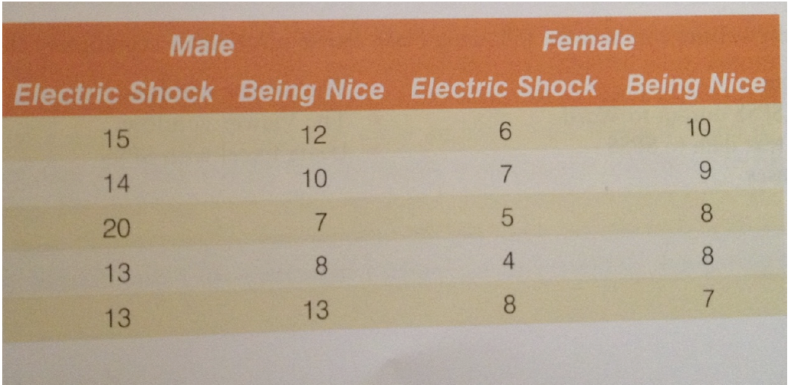

```{r setup, include = FALSE}
#suppress the warnings and other messages from showing in the knitted file.
knitr::opts_chunk$set(
  fig.width  = 8, 
  fig.height = 5, 
  echo       = TRUE, 
  warning    = FALSE, 
  message    = FALSE,
  cache      = TRUE
)
```

# Introduction and objectives

The two previous scripts have provided you with both introductory notions to R, and have also contained ways in which you can replicate the SPSS excercises in R. This time it's time to practice some of the things we have learned and we will do so by mostly replicating the SPSS practice tasks in R. We will also do an exercise together, with which you are already familiar from the first SPSS course. When completing the tasks in the present script, please attempt to solve them yourself. If you are stuck, that's completely okay. You can look in older scripts or work in teams. Keep in mind that practice makes perfect and that R is a skill that requires quite some effort and exercise. Nevertheless, you got this!

## Script prep

Loading the necessary packages from the library of installed packages. If this ever throws an error, then it means that some package might not have been installed on your machine.

```{r script_prep1}
library(tidyverse)
library(ggplot2)
library(Rmisc)
library(haven) # for loading .sav datasets (or other SPSS datasets)
library(dplyr) # great for summary statistics, offers all necessary functions for measures of central tendency
```

Setting up the working directory 

```{r script_prep2}
# Please adjust the path accordingly. This means you should create a separate folder for this second course and script within your (hopefully) already existing R directory. Copy that path here!
setwd("/Users/anamariaplesca/Desktop/Stats planning/Script 3")
```

Other than was the case in previous scripts, datasets will be loaded later on, as they will be needed, and you will have to do that yourself.

# Task 1

Please enter the data shown in Figure 1 into a new data sheet. These data present scores (out of 20) for 20 different students; some of them are male and some female. Some of them were trained using positive reinforcement (the experiment was nice to them) while others received nasty feedback (electric shock). You will need to think about how to structure the data (it should not be entered in the same way that they are laid out in Fig. 1). Save the result in a data frame.

*Hint 1*: The Male and Female labels below might be confusing. Think instead about the fact that you need a certain number of conditions to be represented by male and another by female participants. In other words, you can include male and female labels in a single column. 
*Hint 2*: Do not just type the values. Use a function that we encountered before, that allows you to *repeat* certain values. 


```{r table_recreation, fig.align = 'center', out.width = "75%", fig.cap = "Figure 1"}
# what does the code below do?
# We use the include_graphics() function from the knitr package, and we indicate the path of the image we would like to include. 
# "./images/table.png":
# "." - the point indicates the present working directory, from there we navigate to the images subfolder, and type the name of the image.


```

```{r}
# In total, there are 10 instances of each condition. Since we have a total of 20 data points, 10 will represent electric shock, and 10 positive reinforcement
method <- rep(c("Electric Shock", "Being Nice"), each = 10)

# For each method, we have 5 male and 5 female participants. We can nest the rep call to create the necessary pattern. That means, we create 5 instances of Male and 5 instances of Female values, and then we repeat this pattern 2 times
gender <- rep(rep(c("Male", "Female"), each = 5), 2)

# Score - manual work:
score <- c(15, 14, 20, 13, 13, # male scores + electric shock
           12, 10, 7, 8, 13,   # female scores + electric shock
           6, 7, 5, 4, 8 ,     # male scores + being nice
           10, 9, 8, 8, 7      # female scores + being nice
           )

# putting it all together
method_of_teaching <- data.frame(method, gender, score)

#check the result
method_of_teaching
```


# Task 2

Load the data set `Data with which to play.csv` and please plot the following graphs using `ggplot()`:

In the data, Group 1 represents lecturers and Group 2 represents students.

- 1. A bar chart including error bars (95% Cis) of the mean number of friends for students and
lecturers. Please also describe the plot: what kind of patterns are you seeing?

- 2. A bar chart including error bars (95% Cis) of the mean alcohol consumption for students
and lecturers. Please also describe the plot: what kind of patterns are you seeing?

A few notes: 

- Make sure to describe the plots outside of code chunks!

- Remember that you need to compute summary statistics before you can add error bars to a plot.

*Reminder*: This is a code chunk

```{r code_chunk}
# code chunk. 
```

```{r load_data}
data <- read_csv("Data with which to play.csv")
data
```

Check data structure

```{r}
str(data)
```
We need to make sure that our grouping variable, `Group`, is a factor, otherwise we will get an error later on from `ggplot()`, and since we are here, we could also relabel the factor levels to be more informative

```{r}
# Transforming the group column from numerical to factor 
data$Group <- as.factor(data$Group)

# Re-labeling the factor

data <- data %>% 
  mutate(Group = recode_factor(Group,
                               "1" = "Lecturer",
                               "2" = "Student"))

# Check result
data
```


1. A bar chart including error bars (95% Cis) of the mean number of friends for students and
lecturers. Please also describe the plot: what kind of patterns are you seeing?

Since we will be needing error bars, we need to compute summary statistics
```{r}
data_summary_friends <- summarySE(data, measurevar = "Friends", groupvars = c("Group"))
data_summary_friends
```


```{r plot1}
ggplot(data_summary_friends, aes(x=Group, y=Friends, fill = Group)) + 
    geom_bar(position=position_dodge(), stat="identity") +
    geom_errorbar(aes(ymin=Friends-ci, ymax=Friends+ci), # Minimum CI threshold = Friends - ci 
                                                         # Maximum CI threshold = Friends + ci 
                  width=.2,                              # Width of the error bars
                  position=position_dodge(.9))+
  labs(x = "Group", y = "Average number of friends", 
       title = "Average number of friends depending on group")
```

What do we learn from this barplot?

- On average, students have a (much) higher number of friends compared to lecturers.
- There is a larger degree of variability in the average number of friends for lecturers vs. students.


2. A bar chart including error bars (95% Cis) of the mean alcohol consumption for students
and lecturers. Please also describe the plot: what kind of patterns are you seeing?

Since we will be needing error bars, we need to compute summary statistics
```{r}
data_summary_alcohol <- summarySE(data, measurevar = "Alcohol", groupvars = c("Group"))
data_summary_alcohol
```

```{r plot2}
ggplot(data_summary_alcohol, aes(x=Group, y=Alcohol, fill = Group)) + 
    geom_bar(position=position_dodge(), stat="identity") +
    geom_errorbar(aes(ymin=Alcohol-ci, ymax=Alcohol+ci), # Minimum CI threshold = Friends - ci 
                                                         # Maximum CI threshold = Friends + ci 
                  width=.2,                              # Width of the error bars
                  position=position_dodge(.9))+
  labs(x = "Group", y = "Average alcohol consumption", 
       title = "Average alcohol consumption depending on group")
```

What do we learn from this barplot?

- On average, students and lecturer display a fairly similar alcohol consumption.
- However, within the lecturer group, the error bars show that there is a very large degree of variation. By contrast, there is not so much variation in the alcohol consumption among students.


# Task 3

Let's work with the `Data with which to play.csv` a bit more

- 1 Check the structure of the data

```{r dat_str}
str(data)
data
```

- 1 Build two groups according to age: old and young.

```{r groups}
# Filtering 
old <-  data %>% # Take the `data` dataset AND
 filter(DOB <= 1970) # filter the dataset such that it includes only the people born before and including 1970

# Take a look at the result
old
```


```{r}
young <- data %>% 
  filter(DOB > 1970)

young
```


- 2 Compute the average alcohol intake for each group and compare the values.

```{r alc_group1}
mean_alc_old <- mean(old$Alcohol)
```


```{r alc_group2}
mean_alc_young <- mean(young$Alcohol)
```


```{r alc-comparison}
mean_alc_old > mean_alc_young # F
mean_alc_old == mean_alc_young # F 
mean_alc_old >= mean_alc_young # F
mean_alc_old <= mean_alc_young # T 
mean_alc_old < mean_alc_young #T
```


- 3 Summarize the data! Use the function that allows you to summarize the neuroticism scores. Note that when summarizing the data, the grouping variable should be `Group`.

*Hint*: You have encountered this function before when you needed to compute summary statistics such as the standard deviation, standard error, mean and confidence intervals to add error bars to a plot.

```{r data_summary}
summary_neurotic <- summarySE(data, measurevar = "Neurotic", groupvars = "Group")
summary_neurotic
```

# Task 4

**Plotting within-participants vs. between-participants data**

We will be working with the same data, just entered differently. The data comes from an eye-tracking study with a 1-factor, 2-levels design (factor: parallelism, levels: parallel vs. non-parallel). Originally, these were data from a repeated-measured (within-subjects) design.

- In the file *reading_indep.sav*, the data were entered as if originating from a between-subject design.

- In the file *reading.sav*, the data were entered as if originating from a within-subject design.

**Loading in the data**

```{r reading1}
reading_within <- read_sav("reading.sav")
reading_between <- read_sav("reading_indep.sav")
```

Let's plot the average reading times as a function of condition for each of the two files. 

**Plotting the between-subjects data**

Check the structure of the between-subjects data. For each level of the parallelism factor 1 and 2, there is one corresponding reading time value. However, notice that the paralellism factor is coded with 1 and 2.

```{r reading_between1}
reading_between
```

In order to plot the data, we need out categorical variable to be coded as a factor. Let's check if that's the case

```{r reading_between2}
typeof(reading_between$parallelism) # double
```

Since `parallelism` is currently a numerical variable (double), we need to convert it to a factor.

```{r reading_between3}
reading_between$parallelism <- as.factor(reading_between$parallelism)
str(reading_between) # the parallelism is now coded as a factor
```

Remember that in order to create a barplot with error bars, you need to compute some summary statistics. Please compute summary statistics for the `reading_between` data. Think about the function that you need to use.

Hint: It is the same function that we have been using to create summary statistics before adding error bars to a plot.

```{r reading_between4}
reading_between_summary <- summarySE(reading_between,  measurevar = "reading_times", groupvars = "parallelism")

# Check the result
reading_between_summary
```


```{r reading_between5}
ggplot(data = reading_between_summary, aes(x = parallelism, y = reading_times, fill = parallelism))+ 
  geom_bar(position = "dodge", 
           stat = "summary",   
           fun = "mean",       
           color="black")+     
   geom_errorbar(aes(ymin=reading_times-ci, ymax=reading_times+ci), # Minimum CI threshold = mean - ci (from reading_within_summary)
                                                         # Maximum CI threshold = mean + ci (from reading_within_summary)
                  width=.2,                              # Width of the error bars
                  position=position_dodge(.9))+
  labs(x = "Film", y = "Average reading times", fill = "parallelism",
       title = "Average reading times as a function of parallelism - Between participan")+ 
  scale_fill_brewer(palette = "Blues")
```

**Plotting the within-subjects data**

To plot the within-subjects data, we first need to bring the data in the tall format, where each factor level is assigned a value. Otherwise, the `ggplot()` function cannot work with the data.

```{r reading_within1}
reading_within_tall <- reading_within %>% 
   pivot_longer(cols = 2:3, names_to = "parallelism", values_to = "reading_times", values_drop_na = TRUE)

# Check the result
reading_within_tall

# Make sure that parallelism is a factor
reading_within_tall$parallelism <- as.factor(reading_within_tall$parallelism)

# Make sure that the subject column is a factor
reading_within_tall$subj <- as.factor(reading_within_tall$subj)
```

To add the error bars we also need to compute summary statistics

```{r reading_within2}
# Compute a summary statistics to add 95% CI error bars
reading_within_summary <-summarySE(reading_within_tall, measurevar = "reading_times", groupvars = "parallelism")

# Check the result
reading_within_summary
```

You've seen these values before, right? That is because the data as it is now, is the same as for the between-participants data. 
We need to find a way to remove some of the variability among participants, since this data comes from a repeated-measures design. Luckily, there's a quick and easy way to do this. All you need to do is use the `summarySEwithin()` function. It summarizes data, handling within-subjects variables by removing inter-subject variability. 

```{r}
# Compute an summary statistics adjusted to within-participants design
reading_within_summary_adjusted <-summarySEwithin(reading_within_tall, measurevar = "reading_times", withinvars = "parallelism", idvar = "subj")

# Check the result
reading_within_summary_adjusted
```

Notice the differences in the `sd`, `se`, `ci` columns. 

**Plotting the average reading times as a function of parallelism for the within-participants data**

```{r reading_within3}
ggplot(data = reading_within_summary_adjusted, aes(x = parallelism, y = reading_times, fill = parallelism))+ 
  geom_bar(position = "dodge", 
           stat = "summary",   
           fun = "mean",       
           color="black")+     
   geom_errorbar(aes(ymin=reading_times-ci, ymax=reading_times+ci), # Minimum CI threshold = mean - ci (from reading_within_summary)
                                                         # Maximum CI threshold = mean + ci (from reading_within_summary)
                  width=.2,                              # Width of the error bars
                  position=position_dodge(.9))+
  labs(x = "Parallelism", y = "Average reading times", fill = "parallelism",
       title = "Average reading times as a function of parallelism")+ 
  scale_fill_brewer(palette = "Blues")
```

Keep the steps of this task in mind for [Task 5](#task_5).

# Task 5:

**The following task is taken over from this week's SPSS handout:**

The data set for task 4 comes from an eye-tracking reading study in which we manipulated 2
factors within participants. A first factor was ‘parallelism’, that is whether two clauses had
parallel or non-parallel word order (both clauses have object-subject word order; one clause
has subject-object word order while the other clause has object-subject word order). A second
factor was conjunction (whether the conjunction that linked the 2 clauses was ‘und’ or
‘während’)
.
• You can find the data in the file data QuestionSet1.sav
• In the file ‘np’ in the variable names refers to ‘non-parallel word order’ and ‘pa’ refers to
parallel word order. The variable names identify the four conditions.

• Expectations: It’s been shown that reading times during the second clause of coordinate
structures are faster when the structure of the first and second clause are similar relative to
when they differ. This has been dubbed ‘parallelism facilitation’. If this finding replicates, we
should see that clauses with parallel word order should be read faster than clauses with nonparallel
word order. It’s also interesting to ask whether it’s purely repetition of structure that
procures faster reading times, or whether the conjunction plays a role. ‘And’ expresses that two
things are similar and might thus heighten effects of parallelism (coordination of ‘like’
structures). ‘Während’ by contrast, can be used with a temporal but also with contrastive
meaning and if the conjunction plays a role in parallelism facilitation, a conjunction that is not
expressing similarity of things may rather reduce parallelism facilitation.

- 1: Load the *QuestionSet1.csv* data. Use the read_csv() function.  Type ?read_csv() to see how to supply arguments to the function.

```{r load_data_t5}
question_dat <- read_csv(file = "QuestionSet1.csv")
```

- 2: Please produce a bar graph that illustrates the interaction effect of parallelism and conjunction - this means that both parallelism and conjunction should appear in your barplot. The graph should plot the 4 conditions and also plot the error bars (95 % confidence intervals). 

Hint: If you feel stuck go back to the week 1 script to remember how to build a barplot. Consider all preparation steps we followed in the previous task. 

```{r t5_2}
# Since this is a within-subjects dataset we will summarizare our data using the function summarySEwithin()

summary_question_dat <- summarySEwithin(question_dat, measurevar = "reading_times",withinvars = "condition")
summary_question_dat
```

Drawing the plot

```{r}
ggplot(data = summary_question_dat, aes(x = condition, y = reading_times, fill = condition))+ 
  geom_bar(position = "dodge", 
           stat = "summary",   
           fun = "mean",       
           color="black")+     
   geom_errorbar(aes(ymin=reading_times-ci, ymax=reading_times+ci), # Minimum CI threshold = mean - ci (from reading_within_summary)
                                                         # Maximum CI threshold = mean + ci (from reading_within_summary)
                  width=.2,                              # Width of the error bars
                  position=position_dodge(.9))+
  labs(x = "Condition", y = "Average reading times", fill = "condition",
       title = "Average reading times as a function of condition")+ 
  scale_fill_brewer(palette = "Blues")
```
- 3: Describe briefly how you computed adjusted summary statistics for the present data. Which function did you use and why?

The adjusted summary statistics were computed using the function `summarySEwithin()`


# End of script:

Please make sure to hand in the script before the set deadline. Please only submit scripts that can run and can be knitted without any errors. 


