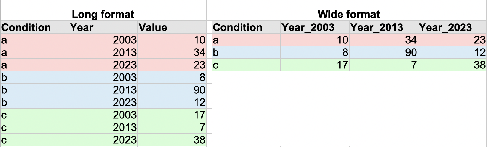

```{r setup, include = FALSE}
#suppress the warnings and other messages from showing in the knitted file.
knitr::opts_chunk$set(
  fig.width  = 8, 
  fig.height = 5, 
  echo       = TRUE, 
  warning    = FALSE, 
  message    = FALSE,
  cache      = TRUE
)
options(repos = list(CRAN="http://cran.rstudio.com/"))
```

```{r}
library(haven)
library(tidyverse)
library(ggplot2)
library(Rmisc)
```

# Learning objectives

1.  Approaching an old problem with a new solution: plotting means for within-participants data with adjusted error bars.
2.  Distinguishing between dependent and independent t-tests.
3.  Learn how to conduct dependent and independent t-tests with R.
4.  Learn which assumptions need to be checked before running t-tests with R.
5.  Practicing "tidy" language with `tidyverse` to transform and reshape data.

# Introduction

Welcome to the 6th week of R! So far we've focused our efforts on exploring and understanding the relationship between two variables (via correlation). This week, we will compare groups of data, and to be more exact, we will compare their means. First off, we will review how between-participants vs. within-participants data should be plotted and you will learn how to do this manually. Next, we will separately conduct dependent and independent t-tests, but not before we will go through all assumptions that need to be fulfilled.

# Plotting error bar graphs for within-participants data

We will be working with data stemming from 24 arachnophobes. 12 of them were asked to look at a spider. Their subsequent anxiety was measured. The remaining 12 were shown only pictures of the same spider and again their anxiety was measured. The data in itself stems from a between-participants design, meaning that different participants were exposed to different conditions.

Let's pretend that this data comes from a within-participants design instead. Let's say that all 24 participants saw spiders in both conditions, but at different times (e.g., picture first, spider second or the other way around.)

You have encountered this task before, but this time around we will learn how to adjust the data manually instead of creating summary statistics adjusted for within-participants designs using the `summarySEwithin()` function. This is particularly useful, because it will remind of the differences we need to keep in mind when it comes to between-participants and within-participants data. Going forward, whenever you are asked to adjust within-participants data, you'll be able to handle it both the difficult and the simple way.

While adjusting the data, we will go through  data transformation steps using R commands from the `tidyverse` package we have used before. This method (compared to base R) makes code readable and easy to understand.
We will use the pipe operator `%>%` (`Ctrl`+`Shift`+`M` - Windows, `Cmd` + `Shift` + `M` - Mac) and the `mutate()` function to create new columns using computations based on already existing columns. 

### Step 1: Loading the data to R

Read the `SpiderWide.csv` data and save it into a variable named `spiderWide`. After you load the data in R, check its structure.

```{r}

```

### Step 2: Compute the average anxiety level for each participant

Create a column called `pMean`, which will include the average anxiety levels for each participant across conditions (picture and real). Check the result afterwards

```{r}

```

### Step 3: Compute grand mean of anxiety.

Next, you will compute the grand mean of anxiety. The grand mean represents the mean of all scores from all participants, no matter the condition they come from. Store the result in the `grandMean` variable.

```{r}

```

### Step 4: Compute the adjustment factor

Looking at the column labeled `pMean` (average anxiety of a participant), you should notice that the values are different across participants. This indicates that some people were overall more scared of spiders than others. The fact that the mean anxiety scores for each participant differ, suggests that there are individual differences between participants. These differences in natural anxiety represent random variation and "contaminate" the error bar graphs. If we do not adjust the values, we will get the same plot as we would get based on between-participants data (independent design).

What we want to do in order to accurately illustrate the within-participants data is to **adjust the scores in each condition such that when we take the mean score across conditions, it is the same for all participants.**

To do that, we compute **an adjustment factor** by **subtracting each participant's average score (pMean) from the grand mean (grandMean)**. Store the result in an additional column called `adj`. Check the result of your operation.

```{r}

```

The scores in the newly created `adj` column represent the difference between each participant's mean anxiety and the mean anxiety levels across all participants (the grand mean). Negative adjustment values indicate that those participants were more anxious than others, while positive values indicate that those participants were less anxious than others. If that sounds confusing, check the value of the `grandMean`. (adapted from Field, 2013, p. 263ff.)

### Step 5: Create adjusted values for each variable

We will use the adjustment scores to adjust existing `picture` and `real` anxiety scores for each participant. To adjust the anxiety scores for each of the two conditions, we need to add the adjustment factor separately to the `picture` and to the `real` scores.

```{r}

```

Why did we do all of this? We needed to remove the variation between participants, because we did not have 24 different participants in our data (or at least we are pretending that this is the case.) Since each participant was tested using repeated measures, in order to accurately show the effect of our manipulation (showing a real vs. depicted spider) it is necessary to remove the individual differences (natural anxiety which varies from one person to the other).

### Step 6: Picking the correct data format for plotting and analysis

Before we start plotting the spider data we have adjusted for a repeated-measures design, we need to think about the "shape of the data" that we need. You will need to think about the shape of the data you are working with every time you wish to draw plots or conduct statistical analyses.

#### Long vs. wide data

Take a look at the Figure below, depicting two tables. On the right side you are seeing data organised in long format, whereas data in wide format is depicted on the right side.

```{r long_vs_wide, fig.align = 'center', out.width = "80%", fig.cap = "Figure 1: Long data depicted on the left side, wide data depicted on the right side", echo=F}

```

---------

**Long data**:

- Includes separate columns for each variable.

- Take a glance at the figure above: there are different columns for condition, year and value.

- Often needed for plotting with `ggplot()`. Example: plotting Value as a function of Year.

- Long data format is often needed for most operations you'll do in R.

---------

**Wide data**:

- Data relating to the same variable occurs in different columns. In other words, values are spread across multiple columns.

- Take a look at the table above: There are multiple columns for `Year` and the values are spread across these columns.

- Can also be used with `ggplot()`, but mostly when wanting to plot correlations, or to explore relationship between numerical variables.  

---------

### Step 7: Reshaping data

Considering that we want to create an error bar graph showing the relationship between the experimental condition (real spider vs. depicted spider) and the measured anxiety, which data format do you think we need?

**Long-shaped data!**

We will reshape our data using the function `pivot_longer()`. 


#### Step 7.1.: Re-arranging and reshaping the dataset

We wish to plot a bar graph with error bars, but we want to keep in the values before and after the adjustment. Let's remove the `pMean` and `adj` columns from the data we will work with for plotting purposes. We will be selecting these out using the function `select()`. We will use the `!` as a negation operator. 

```{r}
# the following select function call means: take the spiderWide data frame and select everything EXCEPT for the pMean and adj columns. 
spiderNew <- spiderWide %>% 
  select(!c("pMean", "adj"))

# Check the result
spiderNew
```

#### Step 7.2.: Creating a conditions column and an Anxiety column

- We need to indicate the number (index) of the columns that we wish to bring in long format. We do that via the `cols = ` argument

- Next, we specify the new column or columns to create from the information stored in the column names of the present data. Via the `names_to` argument we tell R to take the names of the existing columns that we indexed (1 to 4) and put them into a separate single column called condition.

- Next, we specify the name of the column where the values of anxiety will be stored using the argument `values_to`

```{r}
spiderLonger <- spiderNew %>% 
  pivot_longer(cols = 1:4, names_to = "Condition", values_to = "Anxiety")

# Check the result
spiderLonger
```

#### Step 7.3.: Create summary statistics of your data. 

This will be needed in order to generate plots with error bars.

```{r}
spider_long_summary <- summarySE(spiderLonger, measurevar = "Anxiety", groupvars = "Condition")
spider_long_summary
```

Take some time to notice the result of the adjustments. Look especially in the `sd`, `se`, and `ci` columns. The adjusted values are much lower than they were before.

Note: we do not need to use the `summarySEwithin()` function because the data has been adjusted in a previous step. Had you not done that manually, you could have used the `summarySEwithin()` function

### Step 8: Plot the error bar graph

- **Task 1 - Use your plotting skills**: Use your plotting skills to visualize the average effect of spider exposure type on anxiety scores. Plot the conditions on the x-axis and the anxiety on the y-axis. 

```{r}

```

- **Task 2**: Describe this graph as well as the changes brought by the adjustment of the anxiety scores.


# The t-test and how to choose the appropriate test

The exercise you have just finished completing was meant to remind you of the differences between within-participants (dependent) data, and between-participants (independent) data. This is an essential aspect to keep in mind not only when you visualize your data, but also when you want to conduct statistical analyses. 

For instance, you might want to compare whether two groups, or find out whether two conditions are significantly different from each other. For that you could use the **t-test**, which comes in two flavours:

- **Independent t-test**:

- Use it when you want to compare two different experimental conditions.
- Different participants were assigned to each experimental condition (e.g., Participant 1 sees the real condition only, participant 2 sees the picture condition only.)

- **Dependent t-test**:

- Use it when you want to compare two different experimental conditions
- The same participants took part in both conditions at different point in time (e.g., Participant 1 saw the picture condition first and the real condition second, participant 2 the other way around)

## Conducting an independent t-test with R

### Loading the data

We will still be working with the spider data and we will consider these key facts about our data:

- There are 24 different participants
- 12 participants were exposed to real spiders (real condition) and their anxiety was measured right after the exposure.
- 12 participants were exposed to depicted spiders (picture condition) and their anxiety was measured right after the exposure.
- There are two independent samples for our conditions. We want to find out whether participants' anxiety scores differ significantly when they see real vs. depicted spiders. 

Loading the data to R. 

Note: Whenever you work with .dat datasets, I recommend using the read.delim() function.

```{r}
spiderLong <- read_csv("SpiderLong.csv")
```

**Explore the data**

```{r}
str(spiderLong)
```

### Check if the assumptions of the independent t-test are met by the data

#### 1. The sampling distribution should be normally distributed.

- **Task 3**: Check if the sampling distribution is normally distributed and report the result of the test you have chosen to conduct. You need to conduct separate tests for each condition group. 

To do that you need to look at each group of conditions and their corresponding anxiety scores. You can subset your data into two groups using the `filter()` function. Alternatively, use the pivot_wider function to split the `Group` column into two columns representing anxiety values for each conditions. Use the help section or Google to make it easier to figure out which arguments to supply to the function of your choosing.

- 3.1. **Generate descriptive statistics**

Hint: You need a function from the `psych` package.

- 3.2. **Generate histograms and qq - plots**

It is up to you whether you generate the histograms using `ggplot()` or `hist()`. 
Both options do a great job. If you want to get a clearer picture of the distribution of the data please add a density curve.

- 3.3. **Conduct the normality test**

Think about the sample size and pick the right test.

#### 2. The outcome variable: continuous and at least interval.

- **Task 4**: Decide whether the data fulfills this assumption and motivate why.


#### 3. The scores measured in different conditions are independent.

That is because it is assumed that different participants saw different conditions.

- **Task 5**: Decide whether the data fulfills this assumption and motivate why.


#### 4. Homogeneity of variance.

It is assumed that the variances within each of the two independent groups we are comparing are similar.

- **Task 6**: Test whether the variance is equal within the picture and the real group. Report the results of the test. What test did you use for that (we have encountered this before in Week 2)

Hint 1: The name of the test for homogeneity of variance starts with L. 
Hint 2: Google this, if you cannot recall. 


### Conducting the independent t-test

By now, I hope that you have also reached the conclusion that the data fulfills all the assumptions. We can go ahead and conduct the t-test. For that, we will use the `t.test()` function, whereby we need to specify whether the data is paired or not. For independent samples t-tests, the `paired` argument will always be set to `FALSE`.

Before we proceed, there are two more things to think about:

**1. How should the data look like?**

As a rule of thumb, independent t-tests are usually conducted on long data. However, R is not picky when it comes to data shapes and t-tests. You could also use wide data. The sole difference is that for long data, you would use a formula (Dependent Variable (Anxiety) ~ Independent Variable(Group)), whereas for wide data, you would introduce the columns containing the groups you wish to compare (Independent Variable 1 (Picture), Independent Variable 2 (Real)). 

**2. What's the alertnative hypothesis?**

It should be clear before running the test whether your alternative hypothesis is directional (one-tailed), or non-directional (two-tailed). Remember that you cannot just switch between the two after you have conducted the test. This needs to be clear before running it.

**Excourse: Why can't I just decide on the directionality of my test later?**

Let's say you decided to do an experimental Master's thesis where you intend to run an experiment. Usually, before running an experiment, we think of the phenomenon we want to investigate and about what kind of result our experimental manipulation will have. You will often think what will happen in certain conditions and formulate hypotheses in accordance to that prior to you even collecting the data.

For instance: You decide to test how effective some new superseeds are. You plant some of them in shaded crop and the same amount of seeds in a crop that is well lit by the sun. Normally you would expect the seeds from the sunkissed crop to do better than those growing in shade. This is a type of hypothesis you need to specify before such that when you have your data, you know what kind of test you would apply. If you were to simply switch between the directionality of your test, you would test for different hypotheses, which you did not think take into consideration when you designed your study.

-----------

Key facts: We are working with long data at the moment, and our alternative hypothesis could be that the difference in anxiety scores between the picture and the real group is not 0 (two-tailed hypothesis).


```{r}
t.test(Anxiety ~ Group, data = spiderLong, alternative = "two.sided", paired = FALSE)
```

--------
The very same t-test could have been conducted with two dependent variables as a first two arguments, instead of the formula.

If you have built subsets, it could have looked as follows:

- `t.test(picture_subset$Anxiety, real_subset$Anxiety, alternative = "two.sided", paired = FALSE)`

If you have reshaped your data into wider format, it could have looked as follows:

- `t.test(spiderWider$Picture, spiderWider$Real, alternative = "two.sided", paired = FALSE)`

The results would have been the same no matter the option you choose.
---------

**What does the output tell us?**

- the *t*-statistic is `-1.6813` for approx. 21 degrees of freedom. Remember that the t-statistic is computed by dividing the mean difference between the groups (40-47) by the standard error of the mean difference.

- the *p*-value of 0.1072 indicates that the test is not statistically significant, which indicates that there is no significant difference between the groups. The p-value reflects the probability that a test statistic such as the one we observed would occur if the null hypothesis were true (that there is no difference between our two groups - the probability is 10,7%)

- the alternative hypothesis reiterates the two-tailed hypothesis we have specified

- we get 95% confidence intervals: the first value represents the lower bound, the second value the upper bound. The 95% confidence intervals inform us that with 95% certainty, the true mean could lie between -15.648641 and 1.648641.
Because this interval includes 0, it is likely that there is no difference between our two conditions. 

- we get the mean average score for each of the two groups. 


**Reporting the results of the t-test:**

We compared the anixety scores of participants exposed to real vs. depicted spiders. While the result of a two-tailed independent t-test yielded a non-significant result *t*(22) = -1.68, *p* > .05., on average, participants who saw real spiders reported higher anxiety scores (M = 47, SE = 3,18) versus those who were exposed to depicted spiders (M = 40, SE = 2,68).

! Note: *SE* values come from descriptive statistics. Extract these from the step where you check the sampling distribution for normality and compute descriptive statistics.


## Conducting a dependent t-test

You will be entirely in charge of conducting a dependent t-test in R. We will use the same function to conduct the t-test, namely `t.test()`. The only difference is that the `paired` argument will be set to `TRUE`.

*Key facts about the data:*

- We will still use the spider data, but this time around our total sample size is 12
- A total of 12 participants saw both real and picture conditions within the same experiments, but at different points in time (picture first, real second, or the other way around.)

```{r}
spiderWide <- read.csv("SpiderWide.csv")
```

Check the data

```{r}
str(spiderWide)
```


### Check if the assumptions of the dependent t-test are met by the data

#### 1. The sampling distribution of the difference between the groups of scores should be normally distributed

- **Task 7**: Add a column called `difference` to the `spiderWide` dataframe. This column should contain the difference between the picture and real scores for each participant. Use the pipe operator for this operation.

- **Task 8**: Check if the differences between the groups are normally distributed.

  - Generate descriptive statistics
  - Draw histograms and qq-plots
  - Conduct the appropriate test considering the size of the sample

#### 2. The outcome variable: continuous and at least interval.

- **Task 9**: Decide whether the data fulfills this assumption and motivate why.

### Conduct the dependent t-test

- **Task 10**: State your hypothesis and decide which type of data format you will be using

- **Task 11**: Conduct the dependent t-test and report the result

# End of script

Congratulations on completing yet another script and for learning how to conduct indepdenent and dependent t-tests. You are now hopefully well-versed in deciding which test should be implemented when. You have also learned quite a lot about data reshaping and pre-processing, with the help of tidy methods. If you have time on your hands and feel like learning more about tidy data and methods with R, here's a resource I recommend: https://r4ds.had.co.nz/tidy-data.html.

Please save your script and make sure it runs error-free and that it can be knitted. Please make sure to upload it to Moodle. 
