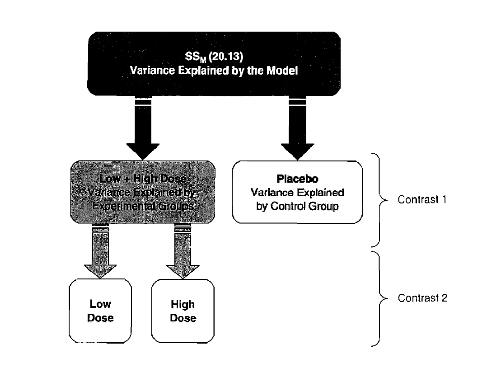

# Introduction

Welcome to the 9th week of R! By now you are already familiar with t-tests, which allow you to compare two groups (two means) both for dependent (within-participants, repeated-measures) and independent (between-participants) data. This week, we'll take it to the next level and discover ANOVA (short for Analysis of Variance). ANOVA analyses allow you analyse data coming from more complex experimental designs with more than two groups and more than one independent variable (predictor). As you will learn in the next couple of weeks, ANOVAs come in many different flavors - this week we will get familiar with the **one-way ANOVA** (one independent variable and several groups, or in other words, one factor, and several levels/conditions). 


# Learning objectives

1. Being able to run **one-way ANOVA** analyses in R.
2. Understand when and how to use planned contrasts vs. post-hoc tests.
3. Understand planned contrasts and implement them in R.
4. Learn how to conduct post-hoc tests. 


# Script prep

Loading packages

```{r, message= F}
library(tidyverse)
library(Rmisc)
library(multcomp)
```

Setting up your working directory

```{r setup_workingdir}

```

# Preparing to run a one-way ANOVA

## Getting to know our dataset

We will work with a dataset that informs about the effects of Viagra intake on several participants' libido. There are three different dosages: some participants received a placebo treatment, while some received a low dose of Viagra and finally, another group of participants received a high dosage of Viagra. We are wondering whether the Viagra treatment with different dosages made a difference on our participants' libido.

- **Task 1** Load the `Viagra.dat` dataset and save it in a variable called `viagraDat`.

```{r task1}

```


- **Task 2** Look at the structure of your data. How many participants do you have in your dataset? How many participants are there in each dosage group?

```{r task2}

```

- **Task 3**  Recode the dose column to make it more informative.
The already existing values represent the following categories:

*1 = Placebo , 2 = Low Dose , 3 = High Dose*

Hint: Use the `recode_factor()` function.

```{r task3}


```

Check the result of recoding

```{r task3.1}


```

Since there will be some plotting involved in the operations to come, please make sure that your dose column is a factor

- **Task 4**: Check whether the dose column is a factor and adjust accordingly. Use the `class()` function.

```{r task4}

```

You already know some things about your data, but to get a nice overview of the values, you need to compute descriptive statistics (mean, st.dev, confidence intervals...)

- **Task 5**: Compute summary statistics for each dosage group and try to describe in your own words how and whether you think the groups differ from each other. Use the `describe()` function from the `psych` package. Look up the function in the `Help` menu and try to compute descriptive statistics for the three groups in a single step. 

If you struggle with this specific function and completing the task in one step, use whatever method works for you.

```{r task5}

```

Use the summary statistics to describe the groups:

- **Task 6** In order to get an even better understanding of the differences between each viagra group, you will plot the data using ggplot() and a lineplot. Make sure to add 95% confidence intervals around the means. To create a lineplot you need to combine `geom_point()` and `geom_line()` layers. Within lineplots, you first plot dots, and then you connect them by lines.

**Line plots** are especially useful for detecting certain "trends" in the data, as well as for illustrating changes in values as a function of experimental manipulation. In this case, we're interested in finding out how the dosage of Viagra might have affected participants' libido across groups.


```{r task6}

```

```{r task6plot}

```

Hmmm, if you did everything right, but you get an error which tells you that each group consists of one observation when you add the line plot geom layer? Also, your categories are not connected by horizontal lines. We would like our dots representing each group to be connected by lines so we can replicate the plots you have generated in SPSS and to make it easier to see the difference the Viagra dosage made on the observed libido across groups. You can fix that, by setting the group argument to 1` group = 1`, within the ggplot aesthetics `aes()`. By doing this, you are telling R to connect the categories represented by color-coded dots. This is a bit of an abstract solution, but it gets the job done. Run the code for the lineplot once again and behold the beauty of the result!

If you struggle with this task, have tried everything but with no result, that's totally fine. Check out the solution here and try to understand it and replicate it on your own: https://box.hu-berlin.de/f/6ae152eed5904f39b8b3/

```{r task6plot2}


```

- **Task 7** Describe the plot. What can you learn from it? What do the error bars suggest?


## Checking the assumptions

There are of course several assumptions that need to be met before you can run a one-way ANOVA. Remember that because we are testing means of three different groups, we are dealing with between-participants data. Thus, we will next make sure that our data meets the assumptions for a **one-way independent samples ANOVA**.

Here's a list of the assumptions that need to be met 

1. The DV is interval or ratio data.

- **Task 8**: Decide whether this assumption is met and explain why yes/no.

2. The observations should be independent.

- **Task 9**: Decide whether this assumption is met and explain why yes/no

3. The residuals should be normally distributed

At this step it's too early to judge whether this is the case or not. We will be able to check this after we run ANOVA on our data. 

<div class="alert alert-warning" role="alert">
What are residuals? Short answer: the unsystematic variation in the data, basically the variation which the ANOVA model cannot explain. This variability comes from factors that are outside experimental control (e.g., age, gender, IQ, etc.).
</div>

4. The variance within groups should be homogeneous.

- **Task 10** Run the appropriate test to check whether this assumption is met.

```{r task10}

```


# Running a one-way ANOVA in R

Running a one-way independent-samples ANOVA is pretty straightforward. All you need to do is use the `aov()` function. As well as that, you need to specify a formula: `Dependent Variable ~ Independent Variable`. You have certainly seen this before, because we've been using this format for t-tests. 

- **Task 11** : Type `?aov()` in the console to access the help page for the `aov()` function. Read through it and see what kind of arguments you need to supply to the function. Scroll all the way down to see examples of the functions.

```{r task11}

```

- **Task 12** : Use `aov()` to run a one-way independent-samples ANOVA and then use `summary()` to see the results. 

```{r task12}

```

```{r task12.1}

```

**What do we learn from the output?**

The output is divided into effects due to the model (the experimental effect) and residuals (this is the unsystematic variation in the data). 

- The effect labelled `dose` is the overall experimental effect. In this row we are told the sums of squares for the model ($SS_M$ = 20.13). The degrees of freedom are equal to 2 and the mean squares value for the model. The sum of squares and mean squares represent the experimental effect. 

- The row labelled `Residuals` gives details of the unsystematic variation within the data (the variation due to natural individual differences in libido and different reactions to Viagra). The table tells us how much unsystematic variation exists (the residual sum of squares, $SS_R$). The table then gives the average
amount of unsystematic variation, the mean squares ($MS_R$)

- The test of whether the group means are the same is represented by the **F-ratio** for the effect of dose. Finally, R tells us whether this value is likely
to have happened by chance. The final column labelled `Pr(>F)` indicates the likelihood of an F-ratio the size of the one obtained occurring if there was no effect in the population.

- In this case, there is a probability of .025 that an F-ratio of this size would occur if in reality there was no effect. Hence, because the observed significance value is less than .05, we can say that overall, administering Viagra to our participants had an effect on their libido.


## Check the normality assumption

Remember that I have mentioned earlier that for independent-samples ANOVA tests, you need to check whether the the residuals are normally distributed. Here's how we can do this:  In the plot below, the quantiles of the residuals are plotted against the quantiles of the normal distribution. A 45-degree reference line is also plotted.

The normal probability plot of residuals is used to check the assumption that the residuals are normally distributed. It should approximately follow a straight line. Uncomment the line below and adjust the argument accordingly, should you have saved the anova model under a different variable name

```{r}
#plot(viagraModel, 2)
```

As all the points fall approximately along this reference line, we can assume that the  normality assumption is fulfilled. Points 14, 11, and 5 have been detected as outliers, which could affect normality and homogeneity of variance. It can be useful to remove outliers to meet the test assumptions, but for now we are good.

**However, at this stage we still do not know exactly what the effect of Viagra was, nor which of our groups differed significantly from each other.**

There are two ways to learn more about the differences between groups:

1. **Planned contrasts**

2. **Post-hoc tests**

>The difference between planned comparisons and post hoc tests can be likened to the difference between one- and two-tailed tests in that planned comparisons are done when you have specific hypotheses that you want to test, whereas post hoc tests are done when you have no specific hypotheses.(Field, 2013, p. 415.)

## What if the data did not satisfy the assumption of homogeneity of variance?

Real data is more often than not imperfect data and you need to be prepared to handle any scenario. Let's pretend that you discovered that the variance across groups was not similar and that the Levene test yielded a significant result. We'll use the same data we used before and for the sake of the example, we'll pretend that it does not meet the assumption of homogeneity of variance.

Following Field's advice (2013, p. 440f.), we can resort to Welch's F. This is still a one-way ANOVA, but the F statistic is Welch-adjusted, such that it can handle differences in variance across groups. In R, use the function `oneway.test()` - the format is the same as for `aov()`. Here's an example - uncomment the line below

```{r}
#oneway.test(libido~dose, data = viagraDat)
```

# Planned contrasts

So far, the one-way ANOVA you have conducted has informed you that the experimental manipulation via different dosages of Viagra has had an effect on the observed libido. In other words, your experimental manipulation was the reason there was more systematic than unsystematic variance. One way to discover the patterns in your data, and differences between the levels of your experimental factor (`dose`) is to use **planned contrasts**.

As a golden rule, whenever you have specific hypotheses about the data, you should use **planned contrasts**. This means of course that these hypotheses need to be formulated before you collect the data.

1. It's pretty common to **compare experimental conditions to the control condition(s)**.

**H1**: The experimental manipulation did have an effect such that there is a difference between control (Placebo) and experimental groups (Viagra groups).

**Contrast 1**: Placebo vs. Viagra groups (Low and High Dosages)


2. Next, it's also usual to **compare the difference between the levels of your experimental manipulation.**

**H1**: There is a difference between the levels of the experimental manipulation, such that the high and low Viagra dose groups had a different effect on the participants' libido.

**Contrast 2**: Viagra high vs. Viagra low groups

ANOVA is based on dividing the total variation into 2 component parts: the variation due to the experimental manipulation ($SS_M$) and the variation due to unsystematic factors ($SS_R$). Planned comparisons take this logic a step further by breaking down the variation due to the experiment into component parts. The exact comparisons that are
carried out depend on the hypotheses to be tested. Figure 1 below illustrates how the experimental variance can be divided so that we can understand much variation stems from the two drug conditions compared to the placebo condition (contrast 1). Then the variation explained by taking Viagra is broken down once again to understand how much is explained by taking a high dose relative to a low dose (contrast 2).

```{r contrasts, fig.align = 'center', out.width = "80%", fig.cap = "Figure 1: Partitioning of experimental variance into component comparisons, Source: Fields, 2013, p. 416", echo=F}

```

## Basic rules for setting up contrasts:

1. Make sure you understand which groups you want to compare.

2. When you compare groups, their associated weights (contrast values) need to sum up to 0.

*Example*: If you compare a high dosage vs. low dosage group, you would assign the weight +1 to the high dosage group and -1 to the low dosage group. They would sum up to 0.

3. Baseline groups usually get negative weights, while comparison groups get positive weights.

*Example*: We're going to be comparing a control group to two experimental treatment groups. In this case the control group gets a -2 weight, and each of the treatment groups will get a +1 weight. Together, they sum up to 0.

4. Before you set the weights, you need to make sure that the order of the levels within your factor makes sense. 

*Example*: If you wish to compare control groups to experimental groups, the control group should be the first level of your factor, followed by the other two treatment groups. 


## Checking the order of levels of our factor.

Next up, we will use the `levels()` function to check the order of the levels within our `dose` factor.

```{r}
#levels(viagraDat$dose)
```

This order is exactly what we need considering the contrasts that we want to conduct:

1. Comparing the Placebo and the Viagra groups together (High + Low).

2. Comparing the Viagra groups: high vs. low dosage.

## Communicate the assigned contrasts to R.


```{r}
# Contrast 1: Placebo (-2) vs. Viagra treatment groups (Low +1, High +1)

#contrast1 <-  c(-2,1,1)

# Contrast 2: Low (-1) vs. high (+1) Viagra treatment groups. 
# Placebo is assigned a 0 weight because it is not part of the contrast. We disregard it and only compare Viagra treatment groups.

#contrast2 <-  c(0,-1,1)
```

## Assigning the contrasts to the factor of interest

The `contrasts()` function allows us to set and check contrasts for the variable/factors of our choice. 
Explore this function using the help menu: `?contrasts()`.

Using the cbind() function we will create a small table of weights for our planned comparisons

```{r}
#cbind(contrast1, contrast2)
```

Next, we will assign these to the contrasts of our dose factor.

```{r}
#contrasts(viagraDat$dose) <-cbind(contrast1, contrast2)
```

- **Task 13** : Check the contrasts assigned to the dose variable using the `contrasts()` function
Describe in rich detail everything you see and understand.

```{r task13}

```

In the next step, we will run the one-way independent samples ANOVA once again

- **Task 14** : Run the ANOVA analysis once more. Save it in a variable and then use the `summary.lm()` function to get the output of the analysis.

Report the results. 

```{r task14}

```

```{r task14.1}

```

What do we learn from the output?

When a planned comparison is done in ANOVA a t-test is conducted comparing the mean of one chunk of variation with the mean of a different chunk. From the significance values of the t-tests we can see that our experimental groups were significantly different from the control (p < .05) but that the experimental groups were not significantly different (p > .05). Keep in mind that our second hypothesis was not directional from the very beginning, or at least I did not mentioned it to be that way.

Had you opted for a one-tailed hypothesis (that a high dose of Viagra would increase libido significantly more than a low dose), the result would have been a bit different because we would divide the observed p-value by 2. The significance of contrast 2 would then tell us that a high dose of Viagra increased libido significantly more than a low dose (p(one-tailed) = .0652/2 = .0326).

In the presence of a non-specific hypothesis (two-tailed) regarding which group would have the highest mean, we would have had to conclude that the dose of Viagra had no significant effect
on libido.

This is a reminder that it is essential to generate clear and very specific hypotheses before data collection. This helps you conduct the right tests for your data and as you can see, the more specific you are with your hypotheses, the better you can perform in your scientific journey of discovery. Please remember that you cannot just switch between one- and two-tailed tests. This decision needs to be made from the very beginning and kept until the very end, regardless of your findings. 


For an in-depth discussion about this, please consult Field, 2013 p. 443-446.


# Post-hoc tests

When *you don't have any specific hypotheses in mind* and when you *simply want to explore the differences between the groups in an exploratory way*, **post-hoc tests are the way to go**.
There are several ways to run post-hoc tests and you will get to know most of the options. Post-hoc tests consist of pairwise comparisons that are designed to compare all different combinations of the treatment groups. We are taking every pair of groups and then performing a t-test on each pair of groups. Pairwise comparisons control the family-wise error by correcting the level of significance for each test such that the overall Type I error rate across all comparisons remains at .05.

## Pairwise t-tests with Bonferroni correction for multiple tests

Bonferroni is a method of correction of the α-level by the number of comparisons that we want to conduct. This is a rather conservative method, whereby the statistical power of the test is lost because of how the family-wise error rate is controlled. In a nutshell, there's an increased probability for a Type II error, where we fail to detect an effect that is actually there. It is recommended to use Bonferroni when you want guaranteed control over the Type I error. 

Bonferroni and related methods (e.g., Holm, Benjamini-Hochberg, Hommel, Hochberg) can be implemented using the `pairwise.t.test()` function that is built into R. 

This function takes the general form:
`pairwise.t.test(outcome, predictor, paired = TRUE/FALSE, p.adjust.method = "method")`

- **Task 15** : Use the pairwise.t.test() function to conduct a Bonferroni-corrected post-hoc test and report the result.

```{r task15}

```


## Tukey's HSD

We can compute **Tukey's HSD** (Tukey Honest Significant Differences, R function: `TukeyHSD()` for performing multiple pairwise-comparisons between the groups of interest. It is recommended to use Tukey's HSD when you have *equal sample sizes* and *similar group variances.*

- **Task 16**: Use the `TukeyHSD()` function to conduct the post-hoc test on the ANOVA model you've already run. Report the results.

```{r task16}

```

## Dunnett's test

If one of the groups of the experimental factor is a control group, then Dunnett’s test is a great option as a post-hoc test.

- **Task 17**: Use the `DunettTest()` function to run Dunnett's test as a post-hoc test.

To complete this task you will need to:
- install the correct package for this function - please Google this. Googling things to solve issues is an essential skill with R. 
- load the appropriate package in the environment
- use the function
- Report the results

Note: Install the package in the console and not in the script, but make a note in form a comment with respect to which package you installed. 


```{r task17}

```

# End of script

If by the end of this script the concept of a one-way ANOVA still feels a little fuzzy, I have some recommendations for you. As always, it's a great idea to read chapter 10 in Andy Field's textbook: Discovering Statistics using R. If you don't feel like reading a lot, there's a way for you to practice more. Here's a great resource about one-way ANOVAs: https://psyteachr.github.io/analysis-v2/one-way-anova.html

Make sure your script runs error-free and can be knitted error-free and please upload it to Moodle.


